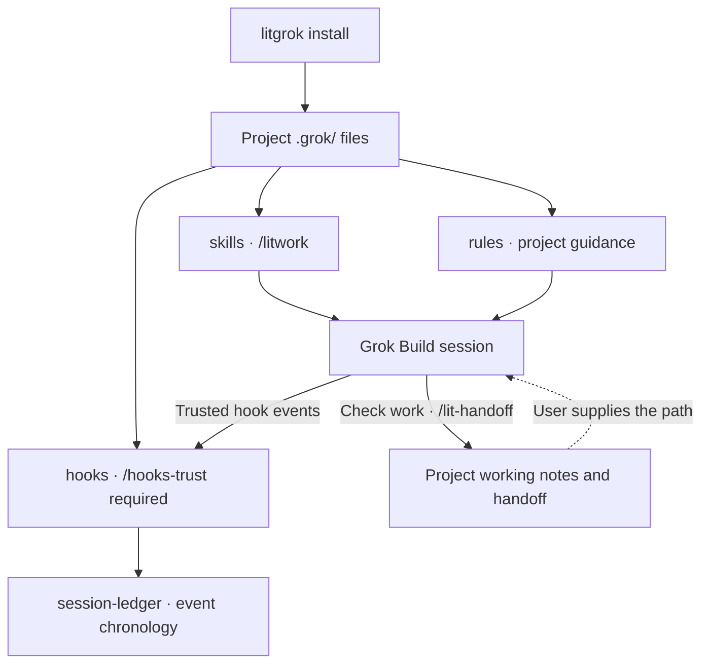

<p align="center"><picture><source media="(prefers-reduced-motion: reduce)" srcset="https://cdn.jsdelivr.net/npm/@litfamily/litgrok@1.0.9/docs/assets/cover-motion-still.webp" /><source media="(prefers-reduced-motion: no-preference)" srcset="https://cdn.jsdelivr.net/npm/@litfamily/litgrok@1.0.9/docs/assets/cover-motion.webp" /></picture></p>

<p align="center"></p>

<details>
<summary>Copy ASCII logo</summary>

```text
                             ▄▄▄▄
                   ▗███▌   ▗██████▖
 ▗▄▄▄▄▄          ▗▟████▌   ▝██████▘
 ▐█████        ▗▟██████▌    ▝▀▜█▀▘
 ▐█████      ▗▟███████▄▄▄▄▄▄▄▄▄▄▄▄▄▄▄▄▄▄▄▄
 ▐█████    ▗▟█████████████████████████ ▐█▀
 ▐█████    ████████████████████████████▀
 ▐█████    ██▛▘   ▄ ▄▄▄▄▖▄▄▄▄▄▄▄▄▄▄▄▄▄▖
 ▐█████    ▀    ▄██ ████▌█████████████▌
 ▐█████       ▄████ ████▌█████████████▌
 ▐█████     ▄█████▛
 ▐█████  ▗▟█████▀▘       ▄▄▄▄▄     ▗▖
 ▐█████ ▐█████▀          █████     ▐▛▀
 ▐█████ ▐███▀            █████
 ▐█████ ▐█▀              █████
 ▐█████ ▝                █████
 ▐█████▄▄▄▄▄▄▄▖          █████
 ▐███████████▛           █████
 ▐██████████▀            █████


grok
```

</details>

<h1 align="center">LitGrok</h1>
<p align="center"><strong>Keep the work lit.</strong></p>

Make something useful in Grok Build. Leave the checked result and the next step with your project.

[한국어](https://cdn.jsdelivr.net/npm/@litfamily/litgrok@1.0.9/README_ko-KR.md) · [Install](#install-in-30-seconds) · [Quick start](#quick-start) · [Skills](#skills-at-a-glance) · [Reference](https://cdn.jsdelivr.net/npm/@litfamily/litgrok@1.0.9/docs/reference.md)

<p align="center">
<a href="#install-in-30-seconds"></a>
<a href="https://cdn.jsdelivr.net/npm/@litfamily/litgrok@1.0.9/LICENSE"></a>
</p>

<p align="center"><a href="https://cdn.jsdelivr.net/npm/@litfamily/litgrok@1.0.9/docs/reference.md"> Docs</a> &nbsp; <a href="#install-in-30-seconds">Install</a> &nbsp; <a href="https://cdn.jsdelivr.net/npm/@litfamily/litgrok@1.0.9/docs/assets/cover-motion.webp"> Cover motion</a> &nbsp; <a href="https://cdn.jsdelivr.net/npm/@litfamily/litgrok@1.0.9/LICENSE"> MIT</a></p>

## Install in 30 seconds

With Node.js and Grok Build available, use an open interactive terminal in the project you want to try. The primary install uses the scoped package:

```bash
npm exec --yes --package @litfamily/litgrok@latest -- litgrok install
```

For an optional isolated trial, set the actual absolute path of the supplied local package, then run these two lines separately:

```bash
LITGROK_PACK='/absolute/path/to/the-provided-package.tgz'
npm exec --yes --package "$LITGROK_PACK" -- litgrok install
```

The default destination is `<project>/.grok/`. Use `--package @litfamily/litgrok@1.0.9` for a pinned install, or add `--user` to install under `~/.grok/`. [Install and upgrade details](https://cdn.jsdelivr.net/npm/@litfamily/litgrok@1.0.9/docs/reference.md#install).

The persistent Grok status row is optional and user-level only. Opt in with:

```bash
npm exec --yes --package @litfamily/litgrok@latest -- litgrok install --user --status-line
```

This adds `[ui.status_line]` to `~/.grok/config.toml` with a two-second refresh. If a config already exists, LitGrok backs it up before changing it; an existing `ui.status_line` is preserved. `uninstall --user` removes only the unchanged LitGrok-managed value. Grok reads this setting from user or administrator configuration, not from project or plugin configuration ([status-line docs](https://docs.x.ai/build/features/status-line), [settings reference](https://docs.x.ai/build/settings/reference)). Example rows are `🔥 LIT IGNITED · lit-plan 🔥 │ grok-4 │ ctx 42%` and `LIT · grok │ grok-4 │ ctx 42%`. The first visible prompt match among `lit-scientific-visualization`, `lit-handoff`, `autoconference`, `autoresearch`, `lit-plan`, and `litwork` sets the discipline; bare `lit` maps to `litwork`, and inline or fenced Markdown code is ignored. With color enabled, the active `LIT IGNITED · <discipline>` label is bold with a per-character truecolor gradient `#FF6337 → #FF2D95 → #00E5FF`; the flames and model/context segment remain unstyled. `NO_COLOR` (including an empty value) or `LITGROK_HUD_COLOR=0` keeps the row plain. Truecolor, bold and emoji rendering in the status row were confirmed on Grok Build 1.0.13. This adds a status command, not another hook registration; LitGrok still ships eleven hook registrations.

### Safety and uninstall

Preview the exact destinations before writing:

```bash
npm exec --yes --package "$LITGROK_PACK" -- litgrok install --dry-run
```

The installer verifies file ownership before upgrades or removal. Modified, foreign, or unsafe destination files cause the operation to refuse rather than overwrite them. `CI`, `NO_COLOR` (even empty), `--no-color`, and `--dry-run` are no-write previews regardless of `--yes`. Without `--yes`, a non-interactive run is also a no-write preview; with `--yes`, it proceeds without a TTY as long as none of the above apply.

For a local-package install, remove it with the same package in the same project. Add `--user` only to remove an installation made with `--user`.

```bash
npm exec --yes --package "$LITGROK_PACK" -- litgrok uninstall
```

Registry uninstall commands:

```bash
npm exec --yes --package @litfamily/litgrok@latest -- litgrok uninstall
npm exec --yes --package @litfamily/litgrok@latest -- litgrok uninstall --user
```

User-level uninstall backs up `~/.grok/config.toml` before removing the unchanged LitGrok-managed status-line keys; other settings and a user-edited status line are preserved. Match the scope used for installation. Re-run `install` to update. The installer does not grant hook trust, create a Git root, write login state or API keys, or choose a model. The hedge guard is fail-open on host errors; a passing package test does not prove live Grok behavior. Check `/hooks` and `grok inspect --json` from the repository root in your own session. [Host boundaries and verification](https://cdn.jsdelivr.net/npm/@litfamily/litgrok@1.0.9/docs/reference.md#verify).

## Quick start

Open or restart Grok Build at the installed project’s Git root. Review and trust its project hooks with `/hooks-trust`, or, on the observed Grok Build 1.0.23 host, use `grok --trust inspect --json`. A plain folder can still load skills and rules while hooks remain unavailable. Check `/skills` for the installed catalog and `/hooks` for hook registrations. LitGrok does not create a Git root or change trust.

Start with a small task that needs no external service or existing test suite. Send this in Grok Build:

```text
/litwork Build a to-do list in one index.html with no external dependencies. Implement add, complete, and delete. Leave the checks performed and the next step. Do not open a browser automatically; give me the steps to check it myself.
```

Open the generated `index.html` yourself and try adding, completing, and deleting an item. Creating a file and checking its behavior are separate steps. Leave any unrun checks marked unverified; report actual errors back to the session.

### Carry the spark into the next session

```text
Plan → Build → Verify → Hand off
```

For a larger change, start with `/lit-plan`, review the saved plan, then invoke `/start-work <plan path>`. Before stopping, ask:

```text
/lit-handoff Record what we built, what we checked, and what remains. Tell me where you saved the handoff.
```

In the next session, supply that returned path and ask Grok Build to read it and check the current files before continuing. The default is `.handoff/HANDOFF.md` in a new Git project or `HANDOFF.md` in a non-Git workspace. An existing root handoff is reused. [Destination and handoff guidance](https://cdn.jsdelivr.net/npm/@litfamily/litgrok@1.0.9/.grok/skills/lit-handoff/SKILL.md).

**Keeping the spark means leaving work another session can pick up.** These are skill-guided steps in your session; LitGrok does not schedule background work or continue after the session ends.

## Key features

> **A spark has been placed in your hands. Put it to work.**
>
> A bug you want fixed. A screen you want built. A project you want to finish.
>
> Starting takes a line. When the session changes, the harder part is finding where you left off. LIT guides you through leaving a goal, a plan, a checked result, and a next step with your project.
>
> **Leave something the next session can pick up.**

It ships 38 skills, 11 agents, one project rule, and eleven hook registrations. The installer copies the complete payload into your project; Grok Build runs the session and owns model selection.

Use `lit-humanizer` for longer edits or a Korean deep review. The pre-write guard checks newly added reader-facing prose: clear block-tier matches must be revised before saving, while warning-tier matches stay advisory. Created DOCX and PPTX files are checked after the tool runs; PDFs are checked with `pdftotext` when it is available. A missing extractor leaves the output unchanged and reports the inspection boundary.

Check browser automation with `npm run probe:browser-drive`. LitGrok names [agent-browser](https://github.com/vercel-labs/agent-browser) as its CLI engine but never installs it for you. If the probe reports it missing, install it yourself with `npm install -g agent-browser` followed by `agent-browser install`.

Package: `@litfamily/litgrok` · Version: `1.0.9` · [MIT](https://cdn.jsdelivr.net/npm/@litfamily/litgrok@1.0.9/LICENSE)

The scientific visualization corpus is packaged at `.grok/vendor/scientific-visualization/`; the numeric `045_scientific-visualization` label remains only in license and provenance filenames.

These route examples are static guidance, not proof of live host behavior.

The five activation contracts ask the model to start each activated response with exactly one line before other response content. For `/litwork`, the requested line is:

🔥 **LIT IGNITED · litwork** 🔥

This is advisory prompt guidance; it does not verify native host display.

The retained `docs/assets/cover.svg` remains editable vector artwork; the README uses a still frame of the motion cover when reduced motion is preferred.

### How it fits inside Grok Build

The installer puts files in the project's `.grok/` directory. `/litwork` provides a checklist for the current session; Grok Build owns execution and model selection. These are the main connections.



The hooks' `.grok/litgrok/session-ledger/` records event order. Judge success from the artifact and its checks. The user supplies the handoff path in the next session; having a record does not automatically resume work.

[Checklist and hook boundaries](https://cdn.jsdelivr.net/npm/@litfamily/litgrok@1.0.9/.grok/skills/litwork/SKILL.md) · [Handoff destinations](https://cdn.jsdelivr.net/npm/@litfamily/litgrok@1.0.9/.grok/skills/lit-handoff/SKILL.md) · [Install details](https://cdn.jsdelivr.net/npm/@litfamily/litgrok@1.0.9/docs/reference.md#install)

### Design and README production

Use `/frontend-ui-ux <surface and outcome>` to build and inspect an authorized interface. A clear brief proceeds to working code; material ambiguity prompts a focused question. Review-only and plan-only requests remain read-only.

Use the `/lit-diagram-drawer` skill for conceptual and technical diagrams. Its exact slash route is a candidate until verified in Grok Build; `/skills` is the discovery surface. Ordinary interfaces stay with `/frontend-ui-ux`, and measured-data plots stay with `/lit-scientific-visualization`.

Use `lit-pptx` for slides and `lit-docx` for reports and Word documents. With bare `lit`, the project rule asks Grok Build to select one or both from the request wording. The deck defaults to AZURE-PRO with Pretendard; a Korean document defaults to korean-generic. The package includes the engines, templates, QA scripts, and pinned first-use cache installers. Slides require Node.js 20.9+; the DOCX workflow and base installer remain separate. Check the skill pages for commands and optional render tools. Skill selection is host guidance until observed in a Grok session.

Use `/readme-studio <repository and outcome>` for a source-checked README, outlined Pretendard/Meslo typography, and portable cover/motion recipes. Check `/skills` after installation. Native image generation depends on the tools exposed in your Grok session; `IMAGE_GENERATION_UNAVAILABLE` permits an explicitly supplied background path. Fonts and renderers are task-local prerequisites. Local output is separate from live host and GitHub/npm acceptance. [README Studio](https://cdn.jsdelivr.net/npm/@litfamily/litgrok@1.0.9/.grok/skills/readme-studio/SKILL.md).

The cover is brand motion made with the LitFamily motion skill, not a recording of a Grok task execution.

## Skills at a glance

All 38 skills, one row each. The route is the one the skill documents; `/skills` shows what your Grok Build session loaded. [Rename compatibility](https://cdn.jsdelivr.net/npm/@litfamily/litgrok@1.0.9/docs/reference.md#skill-rename-compatibility) covers the one-release aliases; old slash routes are not guaranteed.

<table>
<tr><th>What it looks like</th><th>Skill</th><th>What you get</th></tr>
<tr>
<td></td>
<td><code>litwork</code><br /><sub><code>/litwork &lt;goal&gt;</code></sub></td>
<td>A bounded session checklist. LitGrok's hooks log each step to a local ledger.</td>
</tr>
<tr>
<td></td>
<td><code>lit-plan</code><br /><sub><code>/lit-plan &lt;objective&gt;</code></sub></td>
<td>A plan file with numbered rows that <code>/start-work</code> can run. Nothing is edited yet.</td>
</tr>
<tr>
<td></td>
<td><code>start-work</code><br /><sub><code>/start-work &lt;plan path&gt;</code></sub></td>
<td>Runs a plan row by row. A row is checked only after gates A to F pass.</td>
</tr>
<tr>
<td></td>
<td><code>review-work</code><br /><sub><code>/review-work &lt;target&gt;</code></sub></td>
<td>Six read-only review lanes rank what they find by evidence.</td>
</tr>
<tr>
<td></td>
<td><code>litgoal</code><br /><sub><code>/litgoal &lt;request&gt;</code></sub></td>
<td>Shapes one checkable goal and hands you a native <code>/goal</code> line to run. LitGrok stores no goal state.</td>
</tr>
<tr>
<td></td>
<td><code>lit-recap</code><br /><sub><code>/lit-recap</code></sub></td>
<td>A short account with evidence, rebuilt from Grok Build session history.</td>
</tr>
<tr>
<td></td>
<td><code>lit-handoff</code><br /><sub><code>handoff</code> · <code>/lit-handoff</code></sub></td>
<td>Type <code>handoff</code> for a resume file the next session can read. Secrets stay out.</td>
</tr>
<tr>
<td></td>
<td><code>deep-interview</code><br /><sub><code>/deep-interview &lt;request&gt;</code></sub></td>
<td>One question at a time, in a fixed order, until the request is clear enough to plan.</td>
</tr>
<tr>
<td></td>
<td><code>litresearch</code><br /><sub><code>/litresearch &lt;question&gt;</code></sub></td>
<td>Bounded research with every claim traced to a source and no evidence overstated.</td>
</tr>
<tr>
<td></td>
<td><code>lit-crucible</code><br /><sub><code>/lit-crucible &lt;approach&gt;</code></sub></td>
<td>Pressure-tests a brief before planning. Only the risks that survive critique reach the plan.</td>
</tr>
<tr>
<td></td>
<td><code>lit-init</code><br /><sub><code>/lit-init &lt;path&gt;</code></sub></td>
<td>Finds the project guidance that exists, flags conflicts and gaps, and proposes a layout. Nothing is written until you approve.</td>
</tr>
<tr>
<td></td>
<td><code>lit-comprehend</code><br /><sub><code>/lit-comprehend &lt;scope&gt;</code></sub></td>
<td>An explainer page for agent-written work: intuition first, then the walkthrough, then a short quiz.</td>
</tr>
<tr>
<td></td>
<td><code>lit-humanizer</code><br /><sub><code>/lit-humanizer &lt;draft or file&gt;</code></sub></td>
<td>Rewrites stiff model prose in English or Korean. Facts and hedges stay; filler goes.</td>
</tr>
<tr>
<td></td>
<td><code>lit-diagram-drawer</code><br /><sub><code>/lit-diagram-drawer &lt;brief&gt;</code></sub></td>
<td>A checked, editable diagram for slides and documents, with PNG and Office-safe SVG exports.</td>
</tr>
<tr>
<td></td>
<td><code>lit-pptx</code><br /><sub><code>/lit-pptx &lt;presentation request&gt;</code></sub></td>
<td>An editable PowerPoint deck with its Markdown source, AZURE-PRO and Pretendard by default. A QA gate runs on the file, and slides are inspected when LibreOffice is present.</td>
</tr>
<tr>
<td></td>
<td><code>lit-docx</code><br /><sub><code>/lit-docx &lt;document request&gt;</code></sub></td>
<td>A styled Word document with its Markdown source; Korean reports use korean-generic. Prose lint and a DOCX audit run, and pages are inspected when LibreOffice is present.</td>
</tr>
<tr>
<td></td>
<td><code>frontend-ui-ux</code><br /><sub><code>/frontend-ui-ux &lt;surface and outcome&gt;</code></sub></td>
<td>Builds a working interface, then a probe renders it in seven views: four widths, dark, reduced motion and 200% zoom.</td>
</tr>
<tr>
<td></td>
<td><code>readme-studio</code><br /><sub><code>/readme-studio &lt;repository and outcome&gt;</code></sub></td>
<td>A factual README with a cover, outlined type and local motion.</td>
</tr>
<tr>
<td></td>
<td><code>lit-typographic-motion</code><br /><sub><code>/lit-typographic-motion &lt;request&gt;</code></sub></td>
<td>A finished short film from a treatment, rendered by LitGrok's own type engine or stage capture and checked by its QA gate.</td>
</tr>
<tr>
<td></td>
<td><code>lit-scientific-visualization</code><br /><sub><code>/lit-scientific-visualization</code></sub></td>
<td>A publication-ready figure and caption from verified data. The chart type follows the data.</td>
</tr>
<tr>
<td></td>
<td><code>lit-team</code><br /><sub><code>/lit-team</code></sub></td>
<td>Splits work into bounded task packets for Grok Build's built-in subagents. The parent integrates and verifies.</td>
</tr>
<tr>
<td></td>
<td><code>autoresearch</code><br /><sub><code>/autoresearch &lt;mode&gt; &lt;objective&gt;</code></sub></td>
<td>A bounded research campaign: subagents, evidence gates, one synthesis.</td>
</tr>
<tr>
<td></td>
<td><code>autoconference</code><br /><sub><code>/autoconference &lt;mode&gt; &lt;topic&gt;</code></sub></td>
<td>Subagent lanes deliberate on evidence, and the synthesis keeps disagreement.</td>
</tr>
<tr>
<td></td>
<td><code>wikify</code><br /><sub><code>/wikify &lt;mode&gt;</code></sub></td>
<td>A local project knowledge map with sources, kept under <code>.grok/</code>.</td>
</tr>
<tr>
<td></td>
<td><code>debugging</code><br /><sub><code>/debugging &lt;symptom&gt;</code></sub></td>
<td>Reproduces the bug, tests at least three explanations, and fixes only the confirmed cause.</td>
</tr>
<tr>
<td></td>
<td><code>refactor</code><br /><sub><code>/refactor &lt;target&gt;</code></sub></td>
<td>Restructures code in an isolated worktree while tests pin its behavior.</td>
</tr>
<tr>
<td></td>
<td><code>lit-burnoff</code><br /><sub><code>/lit-burnoff &lt;scope&gt;</code></sub></td>
<td>Cleans AI-written bloat out of a change set after tests lock what it does.</td>
</tr>
<tr>
<td></td>
<td><code>lit-burnoff-file</code><br /><sub><code>/lit-burnoff-file &lt;path&gt;</code></sub></td>
<td>Cleans generated prose patterns out of one file and checks the diff.</td>
</tr>
<tr>
<td></td>
<td><code>lit-code</code><br /><sub><code>/lit-code &lt;task&gt;</code></sub></td>
<td>Strict implementation rules: tests first, typed boundaries, small files.</td>
</tr>
<tr>
<td></td>
<td><code>lit-commit</code><br /><sub><code>/lit-commit &lt;operation&gt;</code></sub></td>
<td>Splits your changes into atomic commits in the repo's own style and leaves unrelated work alone.</td>
</tr>
<tr>
<td></td>
<td><code>lsp</code><br /><sub><code>/lsp</code></sub></td>
<td>Turns on Grok Build's built-in LSP code-intel tool, which is off by default.</td>
</tr>
<tr>
<td></td>
<td><code>lsp-setup</code><br /><sub><code>/lsp-setup &lt;path or extension&gt;</code></sub></td>
<td>Checks which language servers Grok Build can see and names the fallback when diagnostics are not exposed.</td>
</tr>
<tr>
<td></td>
<td><code>structural-search</code><br /><sub><code>/structural-search &lt;pattern&gt;</code></sub></td>
<td>Traces code structure with search, read and optional LSP references. It does not invent an engine.</td>
</tr>
<tr>
<td></td>
<td><code>visual-qa</code><br /><sub><code>/visual-qa &lt;target&gt;</code></sub></td>
<td>A screenshot-backed review of a rendered interface.</td>
</tr>
<tr>
<td></td>
<td><code>browser-drive</code><br /><sub><code>/browser-drive &lt;url&gt;</code></sub></td>
<td>Drives a real page after verifying the browser driver. If there is none, it says so.</td>
</tr>
<tr>
<td></td>
<td><code>comment-checker</code><br /><sub><code>/comment-checker &lt;path&gt;</code></sub></td>
<td>Reviews the comments an edit added: reasons stay, narration goes.</td>
</tr>
<tr>
<td></td>
<td><code>rules</code><br /><sub><code>/rules</code></sub></td>
<td>Explains which guidance Grok Build loads for this folder, in what order, and whether hooks are trusted.</td>
</tr>
<tr>
<td></td>
<td><code>litgrok</code><br /><sub><code>/litgrok</code></sub></td>
<td>Explains what the LitGrok package installs, and what it does not.</td>
</tr>
</table>

## Command and hook table

### Prompt or route

Grok Build uses the explicit `/litwork` route for a bounded task. It owns model execution; LitGrok leaves skills, rules, and checked next steps in the project.

| Prompt or route | Effect |
| --- | --- |
| `/litwork` | Start the shipped work checklist in Grok Build. |
| `handoff` or `/lit-handoff` | Carry the checked result and next step into another session. |
| `/lit-plan` | Write a plan with concrete checks. |
| `/start-work <approved-plan>` | Execute an approved plan. |
| `/review-work` | Review a change and its evidence. |
| `/litresearch` | Run bounded, source-traceable research without overstating evidence. |

### Project hooks

| Surface | Registration and boundary |
| --- | --- |
| Project hooks | Eleven registrations are declared in [`hooks/hooks.json`](https://cdn.jsdelivr.net/npm/@litfamily/litgrok@1.0.9/hooks/hooks.json). They require a trusted Git root and `/hooks-trust`; a plain folder may load skills and rules without hooks. |

## Troubleshooting

### Project hooks

Project hooks need a trusted Git project root in Grok Build. A plain folder can still load the installed skills and rules while hooks remain unavailable. For a new disposable project, run `git init` yourself before trusting it; for an existing repository, open Grok Build from its actual root. The installer never runs `git init` or changes trust. In the observed Grok Build 1.0.23 host, `grok --trust inspect --json` accepted the trust-and-inspect route even though `--trust` was omitted from `grok --help`; this is version-specific behavior.

### Install preview

If `CI` or `NO_COLOR` is set, even to an empty value, installation is a no-write preview. So is `--no-color`. Without `--yes`, a non-interactive run is also a no-write preview; with `--yes`, installation proceeds without a TTY as long as none of the above apply. Check that the installer reports actual writes before continuing.

**Status row missing:** the persistent row is optional and uses user or administrator configuration; project and plugin configuration are not read for this setting. See the [status-line reference](https://docs.x.ai/build/features/status-line).

For host limits and current verification steps, see the [operational reference](https://cdn.jsdelivr.net/npm/@litfamily/litgrok@1.0.9/docs/reference.md#verify).

## Links

- [Operational reference](https://cdn.jsdelivr.net/npm/@litfamily/litgrok@1.0.9/docs/reference.md): installation, hooks, terminal output, payload checks, and source provenance.
- [Project rule](https://cdn.jsdelivr.net/npm/@litfamily/litgrok@1.0.9/.grok/rules/00-litgrok.md) and [skill catalog](https://github.com/wjgoarxiv/litgrok/tree/main/.grok/skills).
- [Changelog](https://cdn.jsdelivr.net/npm/@litfamily/litgrok@1.0.9/CHANGELOG.md) and [license](https://cdn.jsdelivr.net/npm/@litfamily/litgrok@1.0.9/LICENSE).

- [Contributing](https://cdn.jsdelivr.net/npm/@litfamily/litgrok@1.0.9/CONTRIBUTING.md), [security](https://cdn.jsdelivr.net/npm/@litfamily/litgrok@1.0.9/SECURITY.md), [conduct](https://cdn.jsdelivr.net/npm/@litfamily/litgrok@1.0.9/CODE_OF_CONDUCT.md), and [support](https://cdn.jsdelivr.net/npm/@litfamily/litgrok@1.0.9/SUPPORT.md).
- [Privacy and local data](https://cdn.jsdelivr.net/npm/@litfamily/litgrok@1.0.9/docs/privacy.md); [migration from the old npm name](https://cdn.jsdelivr.net/npm/@litfamily/litgrok@1.0.9/docs/reference.md#npm-package-migration).

### LITFAMILY

The motion cover at the top shows five armored robots representing the products. Each works independently in its own host; they do not need to be installed together or connected to one another.
