<p align="center"><picture><source media="(prefers-reduced-motion: reduce)" srcset="./docs/assets/cover-motion-still.webp" /><source media="(prefers-reduced-motion: no-preference)" srcset="./docs/assets/cover-motion.webp" />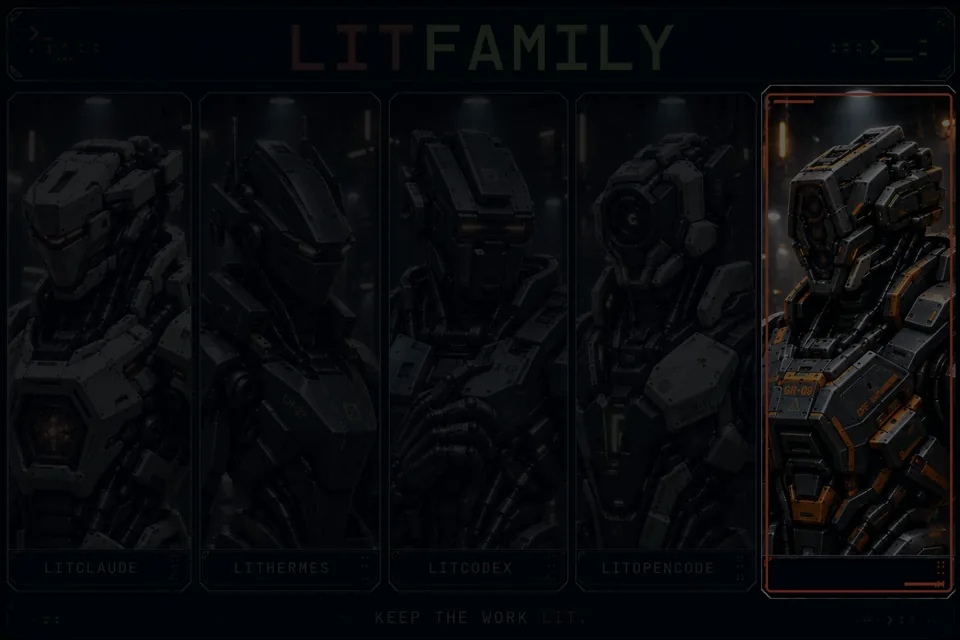</picture></p>

<p align="center">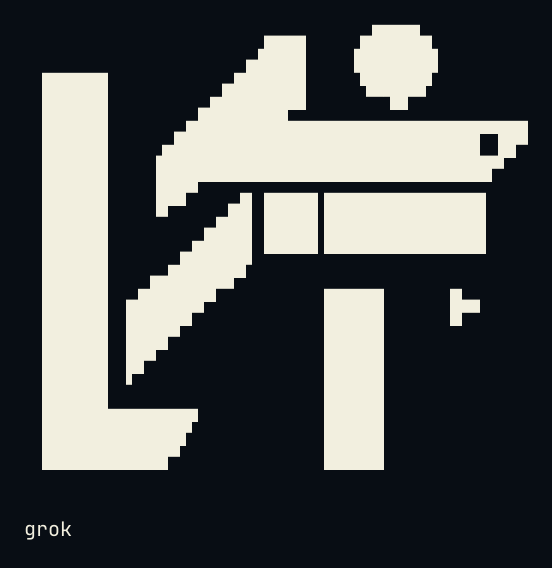</p>

<details>
<summary>Copy ASCII logo</summary>

```text
                             ▄▄▄▄
                   ▗███▌   ▗██████▖
 ▗▄▄▄▄▄          ▗▟████▌   ▝██████▘
 ▐█████        ▗▟██████▌    ▝▀▜█▀▘
 ▐█████      ▗▟███████▄▄▄▄▄▄▄▄▄▄▄▄▄▄▄▄▄▄▄▄
 ▐█████    ▗▟█████████████████████████ ▐█▀
 ▐█████    ████████████████████████████▀
 ▐█████    ██▛▘   ▄ ▄▄▄▄▖▄▄▄▄▄▄▄▄▄▄▄▄▄▖
 ▐█████    ▀    ▄██ ████▌█████████████▌
 ▐█████       ▄████ ████▌█████████████▌
 ▐█████     ▄█████▛
 ▐█████  ▗▟█████▀▘       ▄▄▄▄▄     ▗▖
 ▐█████ ▐█████▀          █████     ▐▛▀
 ▐█████ ▐███▀            █████
 ▐█████ ▐█▀              █████
 ▐█████ ▝                █████
 ▐█████▄▄▄▄▄▄▄▖          █████
 ▐███████████▛           █████
 ▐██████████▀            █████


grok
```

</details>

<h1 align="center">LitGrok</h1>
<p align="center"><strong>Keep the work lit.</strong></p>

Make something useful in Grok Build. Leave the checked result and the next step with your project.

[한국어](./README_ko-KR.md) · [Install](#install-in-30-seconds) · [Quick start](#quick-start) · [Skills](#skills-at-a-glance) · [Reference](./docs/reference.md)

<p align="center">
<a href="#install-in-30-seconds"></a>
<a href="./LICENSE"></a>
</p>

<p align="center"><a href="./docs/reference.md"> Docs</a> &nbsp; <a href="#install-in-30-seconds">Install</a> &nbsp; <a href="./docs/assets/cover-motion.webp"> Cover motion</a> &nbsp; <a href="./LICENSE"> MIT</a></p>

## Why it exists

> **A spark has been placed in your hands. Put it to work.**
>
> A bug you want fixed. A screen you want built. A project you want to finish.
>
> Starting takes a line. When the session changes, the harder part is finding where you left off. LIT guides you through leaving a goal, a plan, a checked result, and a next step with your project.
>
> **Leave something the next session can pick up.**

Grok Build runs the session and chooses the model. LitGrok adds a way of working on top of it: plan the change, build it, check it, and write down where you stopped.

It ships 38 skills, 11 agents, one project rule, and eleven hook registrations. The installer copies all of it into your project.

## Install in 30 seconds

You need Node.js and Grok Build. Open an interactive terminal in the project you want to try, then run:

```bash
npm exec --yes --package @litfamily/litgrok@latest -- litgrok install
```

The files land in `<project>/.grok/`. Add `--user` to install under `~/.grok/` instead, or use `--package @litfamily/litgrok@1.0.14` to pin this release. [Install and upgrade details](./docs/reference.md#install).

Trying a local package instead? Put its real absolute path in a variable, then run these two lines separately:

```bash
LITGROK_PACK='/absolute/path/to/the-provided-package.tgz'
npm exec --yes --package "$LITGROK_PACK" -- litgrok install
```

### An optional status row

LitGrok can also keep a status row on screen in Grok: which LitGrok skill your last prompt started, the model, and how much of the context is used. It lives in your user settings, so you switch it on with a user install:

```bash
npm exec --yes --package @litfamily/litgrok@latest -- litgrok install --user --status-line
```

This adds a `[ui.status_line]` entry to `~/.grok/config.toml` that refreshes every two seconds. LitGrok backs the file up before changing it, and if you already have a status line of your own, it leaves the file alone. Uninstalling with `--user` later removes only what LitGrok added, and only if you haven't edited it since.

Grok reads this setting only from user or administrator configuration, never from a project or a plugin, which is why a project install can't turn it on ([status-line docs](https://docs.x.ai/build/features/status-line), [settings reference](https://docs.x.ai/build/settings/reference)).

<details>
<summary>What the row shows</summary>

While a LitGrok skill is active the row reads like `🔥 LIT IGNITED · lit-plan 🔥 │ grok-4 │ ctx 42%`; the rest of the time it reads like `LIT · grok │ grok-4 │ ctx 42%`.

The label comes from your latest prompt. LitGrok looks for the first of these names that appears in it: `lit-scientific-visualization`, `lit-handoff`, `autoconference`, `autoresearch`, `lit-plan` or `litwork`. A bare `lit` shows as `litwork`. Names inside inline or fenced code don't count, so pasting a snippet won't change the row.

With color on, the active `LIT IGNITED · <discipline>` label is bold and shaded letter by letter from orange-red through pink to cyan (`#FF6337 → #FF2D95 → #00E5FF`). The flames and the model and context parts stay plain. For a row with no color at all, set `NO_COLOR` (an empty value works too) or `LITGROK_HUD_COLOR=0` in Grok's environment. Truecolor, bold and emoji all displayed correctly in the status row on Grok Build 1.0.13.

The row runs as a status command, so the hook count stays at eleven.

</details>

### Safety and uninstall

To see every destination before anything is written, add `--dry-run`:

```bash
npm exec --yes --package @litfamily/litgrok@latest -- litgrok install --dry-run
```

Before it upgrades or removes a file, the installer checks that the file is one it put there. If you edited the file, it belongs to something else, or the path looks unsafe (a symlink, say), the installer stops before writing anything and names the file it refused.

Some runs only preview. The installer lists what it would do, prints `no files written`, and stops. That happens in these cases, even if you pass `--yes`:

- `--dry-run`: you asked to see the plan first.
- `--no-color`, or `NO_COLOR` in the environment, even with an empty value. Unset it when you mean to install.
- `CI` in the environment. A CI job always gets a preview.

Without `--yes`, a run that has no terminal attached, such as a script or a pipe, is a preview too. Add `--yes` when a script should really install; it then works without a terminal, as long as none of the cases above apply.

To remove LitGrok, uninstall the way you installed it: plain for a project install, with `--user` for a user install.

```bash
npm exec --yes --package @litfamily/litgrok@latest -- litgrok uninstall
npm exec --yes --package @litfamily/litgrok@latest -- litgrok uninstall --user
```

If you installed from a local package, remove it with the same package in the same project:

```bash
npm exec --yes --package "$LITGROK_PACK" -- litgrok uninstall
```

A user uninstall backs up `~/.grok/config.toml`, then takes out only the status-line keys LitGrok wrote and you left unchanged. Your other settings stay as they are. To update LitGrok, run `install` again.

A few things stay with you. Trusting hooks, creating the Git root, signing in and choosing a model all happen in Grok Build, and the installer leaves them, and your API keys, untouched. One hook, the hedge guard, stops vague hedging wording before it is written into a deliverable; if the host has an error, it steps aside and lets the write through (it is fail-open). The package tests check the files we ship. To see what your own session loaded, open it from the repository root and check `/hooks` and `grok inspect --json`. [Host boundaries and verification](./docs/reference.md#verify).

## Quick start

Open (or restart) Grok Build from the Git root of the project where you installed LitGrok. Grok runs project hooks only after you trust them, so review them in `/hooks-trust` and trust them there. On Grok Build 1.0.23, `grok --trust inspect --json` did the same from the command line. If the folder isn't a Git repository yet, run `git init` yourself first; in a plain folder the skills and rules load, but the hooks stay off.

`/skills` then lists the installed skills, and `/hooks` lists the hook registrations.

Start with something small that needs no external service and no existing test suite. Send this in Grok Build:

```text
/litwork Build a to-do list in one index.html with no external dependencies. Implement add, complete, and delete. Leave the checks performed and the next step. Do not open a browser automatically; give me the steps to check it myself.
```

Then open `index.html` yourself and add, complete and delete an item. That click-through is the real test. Anything you didn't get to try stays marked unverified, and if something breaks, paste the actual error back into the session.

### Carry the spark into the next session

```text
Plan → Build → Verify → Hand off
```

For a larger change, start with `/lit-plan`, read the plan it saves, then run `/start-work <plan path>`. Before you stop, ask:

```text
/lit-handoff Record what we built, what we checked, and what remains. Tell me where you saved the handoff.
```

In the next session, give Grok Build the path it returned and ask it to read the handoff and check the current files before continuing. The handoff goes to `.handoff/HANDOFF.md` in a new Git project, or to `HANDOFF.md` in a folder without Git. If a root handoff already exists, it is reused. [Where handoffs go](./.grok/skills/lit-handoff/SKILL.md).

All of this happens inside your session, with the skills guiding each step, and LitGrok runs nothing in the background. When the session ends, the work waits there until you, or the next session, pick it up from the handoff.

### What you will see on screen

The pictures below show what LitGrok prints in your terminal, so you can see it before you install anything. Each one is output from LitGrok's own installer, SessionStart hook, prompt hook and status-line command, run on an empty demo project with a temporary home folder. Only the path of that home folder is shortened to `~`. The window frame is drawn around the text, and your own terminal will use its own fonts and colors. Most pictures follow your page theme, a dark window on a dark page and a light one on a light page. Bold text appears here in the regular weight, and the flame emoji is drawn as a small vector icon. The version number, the file count and the timings inside a picture belong to the run they were captured from.

The installer opens with the LIT mark and the package version, then says where the files will go and how many there are. Scope names the folder (here the demo project's `.grok` folder; `--user` would pick your home folder) and Payload counts the files, which are byte-identical copies. The MODEL ROUTE card tells you Grok Build keeps choosing the model, so the installer asks no model question and writes no model keys. This picture stays dark on every page theme, because the cream cells of the mark would fade on a white window.

<p align="center"></p>

*Captured from the installer.*

Add `--dry-run` and you get the same plan followed by the line DRY RUN — no files written, and then one line for every file the installer would copy. The picture stops after the first three of those 1089 lines. Every other preview case listed under [Safety and uninstall](#safety-and-uninstall) prints the same kind of output, and its no-files-written line names the reason.

<p align="center"><picture><source media="(prefers-color-scheme: dark)" srcset="./docs/assets/screens/install-dry-run-dark.webp" />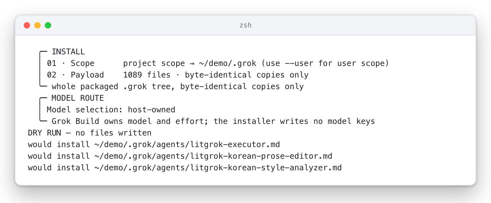</picture></p>

*Captured from the installer with `--dry-run`.*

A real install works through four checks and times each one. PAYLOAD counts the files, SAFETY confirms the install path is clear, OWNERSHIP compares every file with what is already on disk (a fresh project has none, so nothing conflicts), and WRITE copies them. The receipt then reads Ready and lists what stays with you: project hooks need a trusted Git root, so it points to `/hooks-trust`, and it says the installer never runs `git init` or changes trust. The last two lines give the command that pre-warms the video tools and tell you to restart Grok Build. The longest lines wrap at 100 columns the way a terminal wraps them.

<p align="center"><picture><source media="(prefers-color-scheme: dark)" srcset="./docs/assets/screens/install-done-dark.webp" /></picture></p>

*Captured from the installer.*

When a session starts in a trusted project, the SessionStart hook prints the LIT mark and one line saying the payload is present. If you see it, the hooks are loaded in that session; if it never appears, start with [Hooks do not show up](#hooks-do-not-show-up). The hook writes plain characters, so this mark has no colors; the installer banner above is the colored one.

<p align="center"><picture><source media="(prefers-color-scheme: dark)" srcset="./docs/assets/screens/session-start-dark.webp" />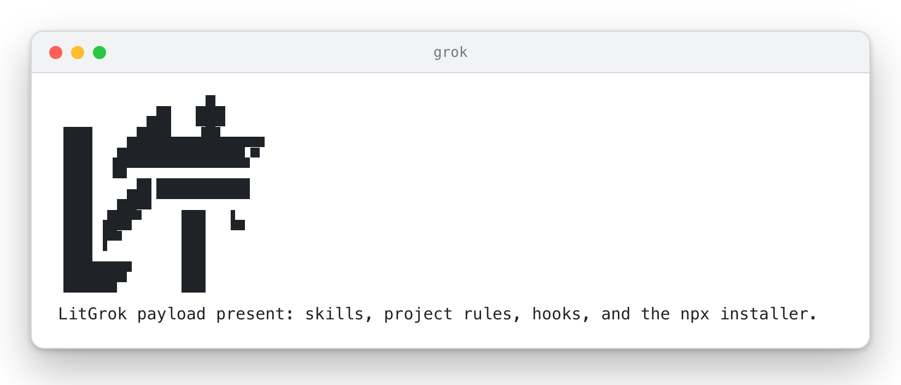</picture></p>

*Captured from the SessionStart hook.*

The optional [status row](#an-optional-status-row) is one line that Grok keeps on screen. Until a prompt names a LitGrok skill it reads LIT · grok, the model and the context used. Once a prompt starts one, here `/litwork`, it switches to LIT IGNITED with the skill name shaded from orange through pink to cyan. The window shows both states: the prompt hook was given an ordinary question first and a `/litwork` prompt second, and the status-line command answered each time. The model name and the 42% are sample values passed in as input, since Grok supplies the real ones.

<p align="center"><picture><source media="(prefers-color-scheme: dark)" srcset="./docs/assets/screens/status-row-dark.webp" />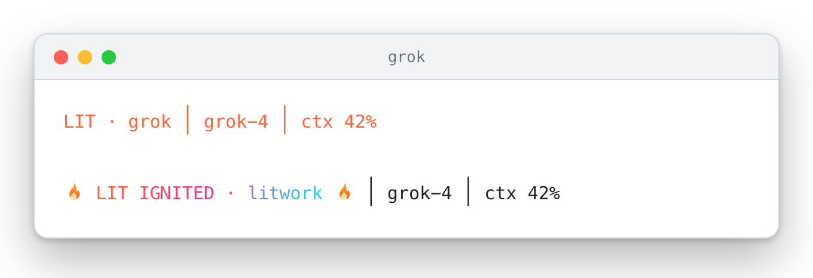</picture></p>

*Captured from the prompt hook and the status-line command.*

## Watch it in motion

This film follows one spark for about twenty-two seconds. The lime dot on the LIT mark lights the mark when you type a line, hops through Plan, Build, Verify and Hand off, lights the status row, rides a handoff card into a fresh terminal and comes home to relight the mark.

<p align="center"><a href="./docs/assets/promo/promo.mp4"><picture><source media="(prefers-reduced-motion: reduce)" srcset="./docs/assets/promo/promo-still.webp" /><source media="(prefers-reduced-motion: no-preference)" srcset="./docs/assets/promo/promo-preview.webp" /></picture></a></p>

The film is animated artwork made with LitGrok's own film skill and set in Pretendard. The terminals and the status row show strings LitGrok really prints. The sample prompt, the card rows and the fresh terminal's line are illustrations, and the flames are drawn shapes. No Grok session was recorded for it. With reduced motion switched on you see a still frame. [Watch the MP4](./docs/assets/promo/promo.mp4) to hear its generated music bed.

## Skills at a glance

All 38 skills, one row each. The routes are the ones each skill documents, and `/skills` shows what your Grok Build session actually loaded. A renamed skill still answers to its old name for one release ([rename compatibility](./docs/reference.md#skill-rename-compatibility)); an old slash route may not carry over.

<table>
<tr><th>What it looks like</th><th>Skill</th><th>What you get</th></tr>
<tr>
<td>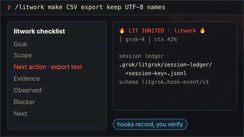</td>
<td><code>litwork</code><br /><sub><code>/litwork &lt;goal&gt;</code></sub></td>
<td>A bounded session checklist. LitGrok's hooks log each step to a local ledger.</td>
</tr>
<tr>
<td>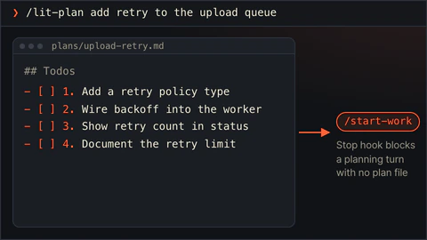</td>
<td><code>lit-plan</code><br /><sub><code>/lit-plan &lt;objective&gt;</code></sub></td>
<td>A plan file with numbered rows that <code>/start-work</code> can run. Nothing is edited yet.</td>
</tr>
<tr>
<td>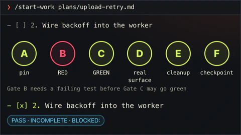</td>
<td><code>start-work</code><br /><sub><code>/start-work &lt;plan path&gt;</code></sub></td>
<td>Runs a plan row by row. A row is checked only after gates A to F pass.</td>
</tr>
<tr>
<td>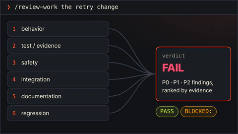</td>
<td><code>review-work</code><br /><sub><code>/review-work &lt;target&gt;</code></sub></td>
<td>Six read-only review lanes rank what they find by evidence.</td>
</tr>
<tr>
<td>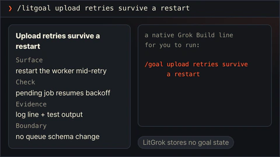</td>
<td><code>litgoal</code><br /><sub><code>/litgoal &lt;request&gt;</code></sub></td>
<td>Shapes one checkable goal and hands you a native <code>/goal</code> line to run. LitGrok stores no goal state.</td>
</tr>
<tr>
<td>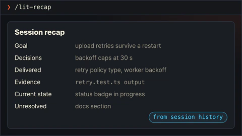</td>
<td><code>lit-recap</code><br /><sub><code>/lit-recap</code></sub></td>
<td>A short account with evidence, rebuilt from Grok Build session history.</td>
</tr>
<tr>
<td>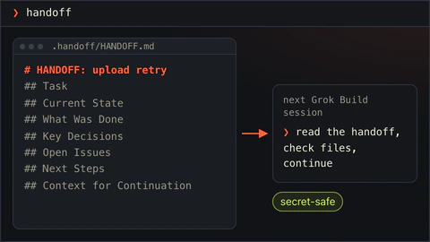</td>
<td><code>lit-handoff</code><br /><sub><code>handoff</code> · <code>/lit-handoff</code></sub></td>
<td>Type <code>handoff</code> for a resume file the next session can read. Secrets stay out.</td>
</tr>
<tr>
<td>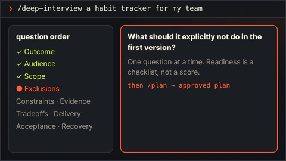</td>
<td><code>deep-interview</code><br /><sub><code>/deep-interview &lt;request&gt;</code></sub></td>
<td>One question at a time, in a fixed order, until the request is clear enough to plan.</td>
</tr>
<tr>
<td>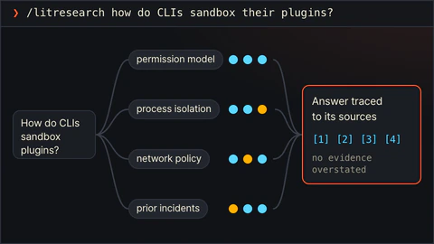</td>
<td><code>litresearch</code><br /><sub><code>/litresearch &lt;question&gt;</code></sub></td>
<td>Bounded research with every claim traced to a source and no evidence overstated.</td>
</tr>
<tr>
<td>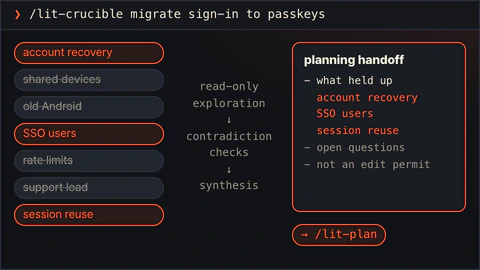</td>
<td><code>lit-crucible</code><br /><sub><code>/lit-crucible &lt;approach&gt;</code></sub></td>
<td>Pressure-tests a brief before planning. Only the risks that survive critique reach the plan.</td>
</tr>
<tr>
<td>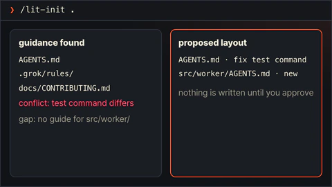</td>
<td><code>lit-init</code><br /><sub><code>/lit-init &lt;path&gt;</code></sub></td>
<td>Finds the project guidance that exists, flags conflicts and gaps, and proposes a layout. Nothing is written until you approve.</td>
</tr>
<tr>
<td>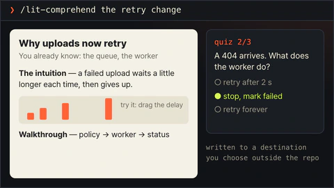</td>
<td><code>lit-comprehend</code><br /><sub><code>/lit-comprehend &lt;scope&gt;</code></sub></td>
<td>An explainer page for agent-written work: intuition first, then the walkthrough, then a short quiz.</td>
</tr>
<tr>
<td>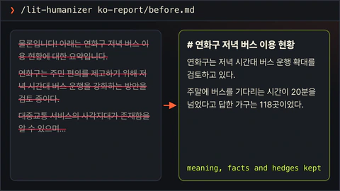</td>
<td><code>lit-humanizer</code><br /><sub><code>/lit-humanizer &lt;draft or file&gt;</code></sub></td>
<td>Rewrites stiff model prose in English or Korean. Facts and hedges stay; filler goes.</td>
</tr>
<tr>
<td>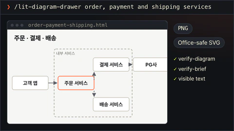</td>
<td><code>lit-diagram-drawer</code><br /><sub><code>/lit-diagram-drawer &lt;brief&gt;</code></sub></td>
<td>A checked, editable diagram for slides and documents, with PNG and Office-safe SVG exports.</td>
</tr>
<tr>
<td>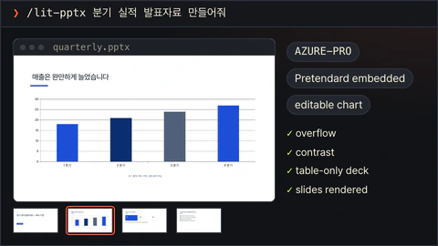</td>
<td><code>lit-pptx</code><br /><sub><code>/lit-pptx &lt;presentation request&gt;</code></sub></td>
<td>An editable PowerPoint deck with its Markdown source, AZURE-PRO and Pretendard by default. A QA gate runs on the file, and slides are inspected when LibreOffice is present.</td>
</tr>
<tr>
<td>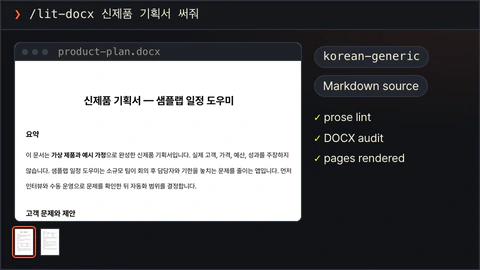</td>
<td><code>lit-docx</code><br /><sub><code>/lit-docx &lt;document request&gt;</code></sub></td>
<td>A styled Word document with its Markdown source; Korean reports use korean-generic. Prose lint and a DOCX audit run, and pages are inspected when LibreOffice is present.</td>
</tr>
<tr>
<td>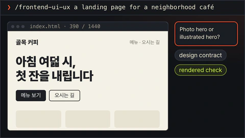</td>
<td><code>frontend-ui-ux</code><br /><sub><code>/frontend-ui-ux &lt;surface and outcome&gt;</code></sub></td>
<td>Builds a working interface, then a probe renders it in seven views: four widths, dark, reduced motion and 200% zoom.</td>
</tr>
<tr>
<td>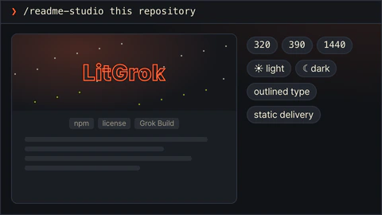</td>
<td><code>readme-studio</code><br /><sub><code>/readme-studio &lt;repository and outcome&gt;</code></sub></td>
<td>A factual README with a cover, outlined type and local motion.</td>
</tr>
<tr>
<td>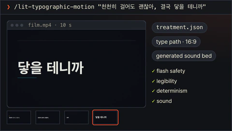</td>
<td><code>lit-typographic-motion</code><br /><sub><code>/lit-typographic-motion &lt;request&gt;</code></sub></td>
<td>A finished short film from a treatment, rendered by LitGrok's own type engine or stage capture and checked by its QA gate.</td>
</tr>
<tr>
<td>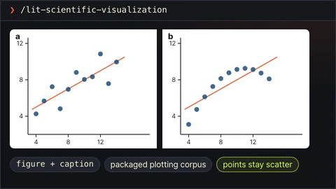</td>
<td><code>lit-scientific-visualization</code><br /><sub><code>/lit-scientific-visualization</code></sub></td>
<td>A publication-ready figure and caption from verified data. The chart type follows the data.</td>
</tr>
<tr>
<td>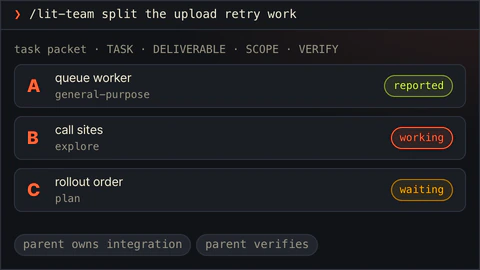</td>
<td><code>lit-team</code><br /><sub><code>/lit-team</code></sub></td>
<td>Splits work into bounded task packets for Grok Build's built-in subagents. The parent integrates and verifies.</td>
</tr>
<tr>
<td>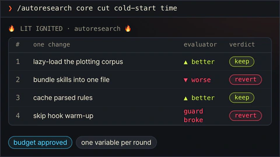</td>
<td><code>autoresearch</code><br /><sub><code>/autoresearch &lt;mode&gt; &lt;objective&gt;</code></sub></td>
<td>A bounded research campaign: subagents, evidence gates, one synthesis.</td>
</tr>
<tr>
<td>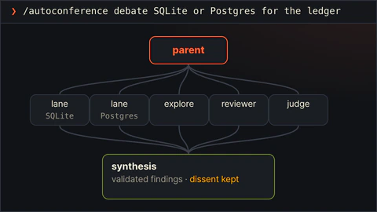</td>
<td><code>autoconference</code><br /><sub><code>/autoconference &lt;mode&gt; &lt;topic&gt;</code></sub></td>
<td>Subagent lanes deliberate on evidence, and the synthesis keeps disagreement.</td>
</tr>
<tr>
<td>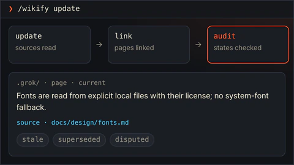</td>
<td><code>wikify</code><br /><sub><code>/wikify &lt;mode&gt;</code></sub></td>
<td>A local project knowledge map with sources, kept under <code>.grok/</code>.</td>
</tr>
<tr>
<td>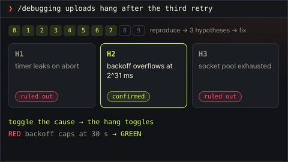</td>
<td><code>debugging</code><br /><sub><code>/debugging &lt;symptom&gt;</code></sub></td>
<td>Reproduces the bug, tests at least three explanations, and fixes only the confirmed cause.</td>
</tr>
<tr>
<td>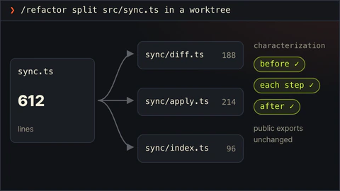</td>
<td><code>refactor</code><br /><sub><code>/refactor &lt;target&gt;</code></sub></td>
<td>Restructures code in an isolated worktree while tests pin its behavior.</td>
</tr>
<tr>
<td>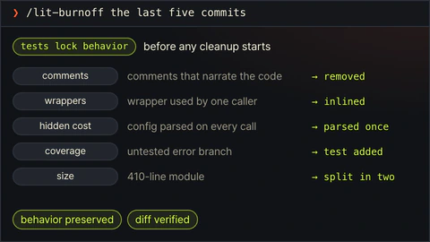</td>
<td><code>lit-burnoff</code><br /><sub><code>/lit-burnoff &lt;scope&gt;</code></sub></td>
<td>Cleans AI-written bloat out of a change set after tests lock what it does.</td>
</tr>
<tr>
<td>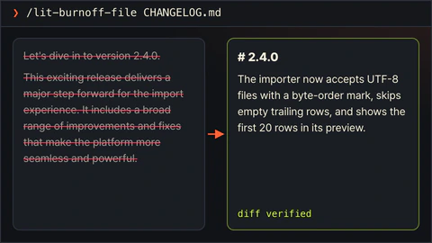</td>
<td><code>lit-burnoff-file</code><br /><sub><code>/lit-burnoff-file &lt;path&gt;</code></sub></td>
<td>Cleans generated prose patterns out of one file and checks the diff.</td>
</tr>
<tr>
<td>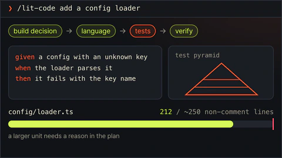</td>
<td><code>lit-code</code><br /><sub><code>/lit-code &lt;task&gt;</code></sub></td>
<td>Strict implementation rules: tests first, typed boundaries, small files.</td>
</tr>
<tr>
<td>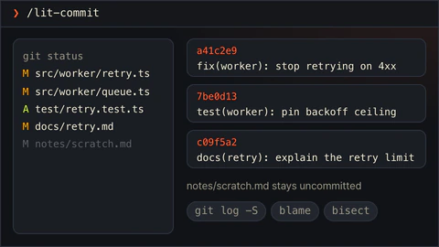</td>
<td><code>lit-commit</code><br /><sub><code>/lit-commit &lt;operation&gt;</code></sub></td>
<td>Splits your changes into atomic commits in the repo's own style and leaves unrelated work alone.</td>
</tr>
<tr>
<td>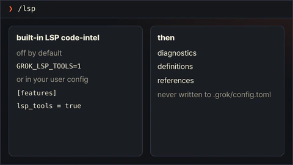</td>
<td><code>lsp</code><br /><sub><code>/lsp</code></sub></td>
<td>Turns on Grok Build's built-in LSP code-intel tool, which is off by default.</td>
</tr>
<tr>
<td>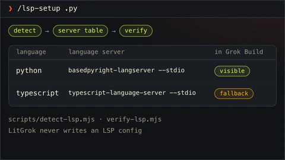</td>
<td><code>lsp-setup</code><br /><sub><code>/lsp-setup &lt;path or extension&gt;</code></sub></td>
<td>Checks which language servers Grok Build can see and names the fallback when diagnostics are not exposed.</td>
</tr>
<tr>
<td>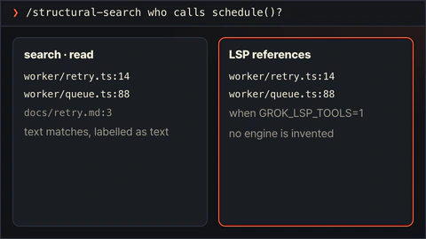</td>
<td><code>structural-search</code><br /><sub><code>/structural-search &lt;pattern&gt;</code></sub></td>
<td>Traces code structure with search, read and optional LSP references. It does not invent an engine.</td>
</tr>
<tr>
<td>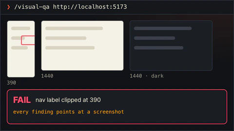</td>
<td><code>visual-qa</code><br /><sub><code>/visual-qa &lt;target&gt;</code></sub></td>
<td>A screenshot-backed review of a rendered interface.</td>
</tr>
<tr>
<td>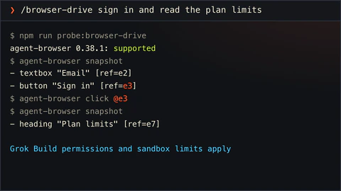</td>
<td><code>browser-drive</code><br /><sub><code>/browser-drive &lt;url&gt;</code></sub></td>
<td>Drives a real page after verifying the browser driver. If there is none, it says so.</td>
</tr>
<tr>
<td>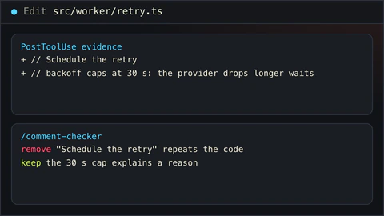</td>
<td><code>comment-checker</code><br /><sub><code>/comment-checker &lt;path&gt;</code></sub></td>
<td>Reviews the comments an edit added: reasons stay, narration goes.</td>
</tr>
<tr>
<td>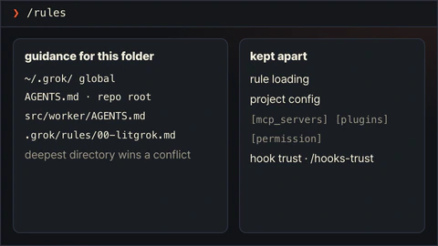</td>
<td><code>rules</code><br /><sub><code>/rules</code></sub></td>
<td>Explains which guidance Grok Build loads for this folder, in what order, and whether hooks are trusted.</td>
</tr>
<tr>
<td>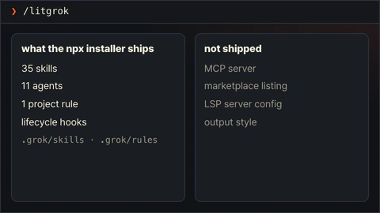</td>
<td><code>litgrok</code><br /><sub><code>/litgrok</code></sub></td>
<td>Explains what the LitGrok package installs, and what it does not.</td>
</tr>
</table>

## The routes you will use most

Day to day, most work goes through these six. Each one hands Grok Build a skill's instructions; your session shows what the model actually does with them.

| Type this | What happens |
| --- | --- |
| `/litwork` | Starts the shipped work checklist for a bounded task. |
| `handoff` or `/lit-handoff` | Carries the checked result and the next step into another session. |
| `/lit-plan` | Writes a plan with concrete checks. |
| `/start-work <approved-plan>` | Executes a plan you approved. |
| `/review-work` | Reviews a change and its evidence. |
| `/litresearch` | Runs bounded, source-traceable research without overstating the evidence. |

### Project hooks

The eleven hook registrations live in [`hooks/hooks.json`](./hooks/hooks.json). They show the LitGrok mark when a session starts, keep the status row current, check deliverable wording before it is written, and log the order of events. Like any project hook, they run only in a trusted Git root (see [Quick start](#quick-start)).

## Automatic handoff

A long session eventually fills the context window, and Grok then compacts the conversation and drops detail. LitGrok can ask for a handoff before that happens: once the context reaches a percent you choose, the model writes one while it still remembers everything. The feature is off until you turn it on, and the percent is always yours. LitGrok has no built-in default.

Turn it on from the project root and pick your own number:

```bash
npm exec --yes --package @litfamily/litgrok@latest -- litgrok auto-handoff on 60
```

- `auto-handoff on <percent>` turns it on at that percent, a whole number from 1 to 99. Plain `auto-handoff on` brings back the percent you used last, and asks for one if you never chose.
- `auto-handoff off` turns it off and remembers the percent for next time.
- `auto-handoff status` shows whether it is on, where each setting came from, and any warning.
- `LITGROK_AUTO_HANDOFF=1` turns it on for every session started from that environment, and `0` keeps it off there. `LITGROK_AUTO_HANDOFF_PERCENT=60` sets the percent and wins over the saved one. A percent outside 1 to 99 leaves the feature off, and `status` tells you why.

The choice is saved in `.grok/litgrok/auto-handoff.json` in the project. Here is what happens once it is on, and which steps LitGrok does for you on Grok Build:

| Step | On Grok Build |
| --- | --- |
| Reading how full the context is | Automatic, but only through the status row from [An optional status row](#an-optional-status-row). Grok gives hooks no other view of the percent, so without the row nothing happens. |
| Asking for the handoff | Automatic. When a turn ends at or above your percent, the Stop hook keeps the model working and tells it to write the handoff with the `lit-handoff` procedure. It asks once per crossing, and the model still has to follow the request. |
| Compacting | Yours to run. Grok lets no hook start a compaction, so the model ends with one plain line, "Handoff saved. Run /compact now." Grok also compacts by itself at 85 percent unless you changed that, so pick a percent below it. `status` warns when yours is not. |
| Bringing the handoff back | A reminder. After the compaction, the next turn end asks the model to read the handoff this session saved. Grok discards what a prompt hook prints, so the reminder cannot arrive any sooner. LitGrok skips a handoff that is older than the request or that another session wrote. |

After you compact and the context grows past your percent again, the cycle starts over. Like every project hook, this one runs only in a trusted Git root (`/hooks-trust`, see [Quick start](#quick-start)). The context figure lives in the temporary status-row folder described in the [reference](./docs/reference.md#persistent-status-line-opt-in), and each step is noted in the session ledger.

## How it works

Everything LitGrok adds lives in the project's `.grok/` folder. When you run `/litwork`, the current session gets a checklist to follow; Grok Build still runs it and picks the model. Here is how the pieces connect:

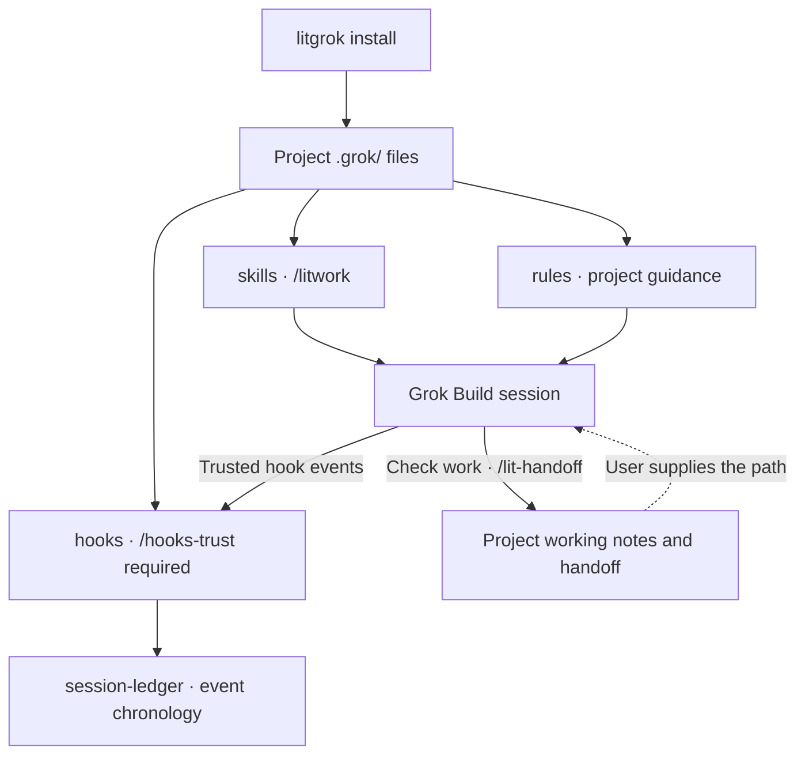

Once trusted, the hooks log the order of events in `.grok/litgrok/session-ledger/`. To continue in a new session, give it the handoff path.

[Checklist and hook boundaries](./.grok/skills/litwork/SKILL.md) · [Handoff destinations](./.grok/skills/lit-handoff/SKILL.md) · [Install details](./docs/reference.md#install)

### The first line of an activated reply

Several LitGrok skills, `/litwork` among them, ask the model to open an activated reply with one line before anything else. For `/litwork` it looks like this:

🔥 **LIT IGNITED · litwork** 🔥

If you see it, the work has started. The line is a request to the model, so check the result itself before you trust it.

## Pages, slides, documents and prose

Use `/frontend-ui-ux <surface and outcome>` to build and inspect an interface you are allowed to change. With a clear brief it goes straight to working code; when something important is unclear, it asks one focused question first. If you only ask for a review or a plan, it changes no files.

For concept and technical diagrams, use the `lit-diagram-drawer` skill. Its slash route, `/lit-diagram-drawer`, hasn't been confirmed in a live Grok Build session yet, so find it through `/skills`. Ordinary interfaces go to `/frontend-ui-ux`, and plots of measured data go to `/lit-scientific-visualization`.

For slides, use `lit-pptx`; for reports and Word documents, use `lit-docx`. If you type a bare `lit` and describe what you want, the project rule asks Grok Build to choose one or both from your wording, and your session shows which one it picked. Decks start from the AZURE-PRO template with the Pretendard font, and Korean documents use the korean-generic style.

Both skills bring their engines, templates and QA scripts with them. The first time you use one, it installs its pinned dependencies into its own cache. Slides need Node.js 20.9 or newer; Word documents and the base installer don't depend on that. Each skill page lists its commands and the optional render tools.

`/readme-studio <repository and outcome>` writes a README whose claims are checked against the repository, with outlined Pretendard or Meslo lettering and cover and motion recipes you can take elsewhere. It shows up in `/skills` after installation. Pictures depend on whether your Grok session offers image generation; if it reports `IMAGE_GENERATION_UNAVAILABLE`, give it a background image path instead. You set up fonts and renderers for each task. A local render is the first look; check the finished page again where it will live, on GitHub or npm. [README Studio](./.grok/skills/readme-studio/SKILL.md).

Use `lit-humanizer` for longer edits or a careful Korean review. Separately, a guard reads new text before Grok writes it into a reader-facing file. Clear problems have to be rewritten before the file is saved; milder ones come back as suggestions. Word and PowerPoint files are read right after they are created, and PDFs too when `pdftotext` is installed. If it can't read a file, it leaves the file as it is and tells you what it skipped.

### Browser automation

The `browser-drive` skill drives pages through [agent-browser](https://github.com/vercel-labs/agent-browser), a command-line browser engine that LitGrok doesn't install for you. Check for it with `npm run probe:browser-drive`. If the probe says it's missing, run `npm install -g agent-browser` and then `agent-browser install`.

### Scientific figures

The scientific visualization corpus is packaged at `.grok/vendor/scientific-visualization/`. The numeric `045_scientific-visualization` label remains only in license and provenance filenames.

## When something does not work

### Hooks do not show up

Grok Build runs project hooks only from a trusted Git project root. In a plain folder, the installed skills and rules still load, and the hooks stay off.

For a new practice project, run `git init` yourself, then trust it. For an existing repository, open Grok Build from its real root. The installer never runs `git init` or changes trust.

On Grok Build 1.0.23, `grok --trust inspect --json` trusted and inspected the project in one step, even though `grok --help` doesn't list `--trust`. Other versions may behave differently.

### The installer only previews

Read the installer's output. If it says `no files written`, the same line names the reason: `DRY RUN`, `NO COLOR` or `NON-INTERACTIVE`. The cases behind each one are listed under [Safety and uninstall](#safety-and-uninstall); fix that one, run again, and wait for real writes before you continue.

### The status row is missing

Grok reads the row from user or administrator configuration, not from a project or plugin, so add it with a user install: `install --user --status-line`. See the [status-line reference](https://docs.x.ai/build/features/status-line).

For host limits and current verification steps, see the [operational reference](./docs/reference.md#verify).

## Learn more

- [Operational reference](./docs/reference.md): installation, hooks, terminal output, payload checks, and source provenance.
- [Project rule](./.grok/rules/00-litgrok.md) and [skill catalog](./.grok/skills).
- [Changelog](./CHANGELOG.md) and [license](./LICENSE).
- [Privacy and local data](./docs/privacy.md); [migration from the old npm name](./docs/reference.md#npm-package-migration).
- [Security](./SECURITY.md), [code of conduct](./CODE_OF_CONDUCT.md), and [support](./SUPPORT.md).

To contribute, start with a small issue or pull request. The [contributing guide](./CONTRIBUTING.md) lists the checks to run first.

### LITFAMILY

The five armored robots on the cover stand for the five LitFamily products. Each one works on its own in its own host: install just the one you use, and it needs none of the others.

The cover is brand motion made with the LitFamily motion skill: animated artwork, with no Grok session recorded in it. The editable vector version is `docs/assets/cover.svg`, and if your system asks for reduced motion, you see a still frame instead.
