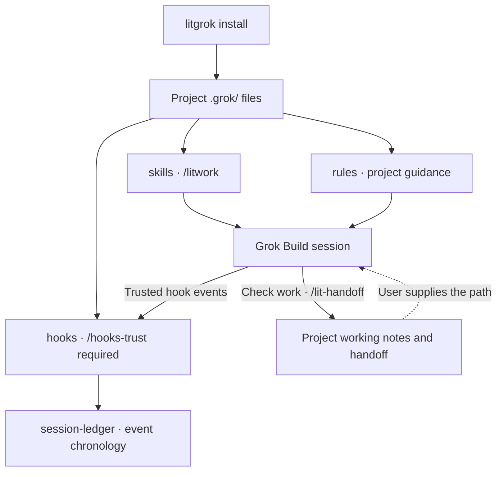

<p align="center"><picture><source media="(prefers-reduced-motion: reduce)" srcset="./docs/assets/cover-motion-still.webp" /><source media="(prefers-reduced-motion: no-preference)" srcset="./docs/assets/cover-motion.webp" /></picture></p>

<p align="center"></p>

<details>
<summary>Copy ASCII logo</summary>

```text
                             ▄▄▄▄
                   ▗███▌   ▗██████▖
 ▗▄▄▄▄▄          ▗▟████▌   ▝██████▘
 ▐█████        ▗▟██████▌    ▝▀▜█▀▘
 ▐█████      ▗▟███████▄▄▄▄▄▄▄▄▄▄▄▄▄▄▄▄▄▄▄▄
 ▐█████    ▗▟█████████████████████████ ▐█▀
 ▐█████    ████████████████████████████▀
 ▐█████    ██▛▘   ▄ ▄▄▄▄▖▄▄▄▄▄▄▄▄▄▄▄▄▄▖
 ▐█████    ▀    ▄██ ████▌█████████████▌
 ▐█████       ▄████ ████▌█████████████▌
 ▐█████     ▄█████▛
 ▐█████  ▗▟█████▀▘       ▄▄▄▄▄     ▗▖
 ▐█████ ▐█████▀          █████     ▐▛▀
 ▐█████ ▐███▀            █████
 ▐█████ ▐█▀              █████
 ▐█████ ▝                █████
 ▐█████▄▄▄▄▄▄▄▖          █████
 ▐███████████▛           █████
 ▐██████████▀            █████


grok
```

</details>

<h1 align="center">LitGrok</h1>
<p align="center"><strong>Keep the work lit.</strong></p>

Make something useful in Grok Build. Leave the checked result and the next step with your project.

[한국어](./README_ko-KR.md) · [Install](#install-in-30-seconds) · [Quick start](#quick-start) · [Skills](#skills-at-a-glance) · [Reference](./docs/reference.md)

<p align="center">
<a href="#install-in-30-seconds"></a>
<a href="./LICENSE"></a>
</p>

<p align="center"><a href="./docs/reference.md"> Docs</a> &nbsp; <a href="#install-in-30-seconds">Install</a> &nbsp; <a href="./docs/assets/cover-motion.webp"> Cover motion</a> &nbsp; <a href="./LICENSE"> MIT</a></p>

## Why it exists

> **A spark has been placed in your hands. Put it to work.**
>
> A bug you want fixed. A screen you want built. A project you want to finish.
>
> Starting takes a line. When the session changes, the harder part is finding where you left off. LIT guides you through leaving a goal, a plan, a checked result, and a next step with your project.
>
> **Leave something the next session can pick up.**

Grok Build runs the session and chooses the model. LitGrok adds a way of working on top of it: plan the change, build it, check it, and write down where you stopped.

It ships 38 skills, 11 agents, one project rule, and eleven hook registrations. The installer copies the complete payload into your project.

## Install in 30 seconds

You need Node.js and Grok Build. Open an interactive terminal in the project you want to try, then run:

```bash
npm exec --yes --package @litfamily/litgrok@latest -- litgrok install
```

The files land in `<project>/.grok/`. Add `--user` to install under `~/.grok/` instead, or use `--package @litfamily/litgrok@1.0.10` to pin this release. [Install and upgrade details](./docs/reference.md#install).

Trying a local package instead? Put its real absolute path in a variable, then run these two lines separately:

```bash
LITGROK_PACK='/absolute/path/to/the-provided-package.tgz'
npm exec --yes --package "$LITGROK_PACK" -- litgrok install
```

### An optional status row

Grok can show a persistent LitGrok status row. It is optional, and you can only turn it on at user level:

```bash
npm exec --yes --package @litfamily/litgrok@latest -- litgrok install --user --status-line
```

This adds `[ui.status_line]` to `~/.grok/config.toml`, refreshing every two seconds. If that file already exists, LitGrok backs it up before changing it, and it leaves an existing `ui.status_line` alone. Later, `uninstall --user` removes only the LitGrok-managed value, and only if you have not changed it.

Grok reads this setting from user or administrator configuration, not from project or plugin configuration ([status-line docs](https://docs.x.ai/build/features/status-line), [settings reference](https://docs.x.ai/build/settings/reference)).

<details>
<summary>What the row shows</summary>

Two example rows: `🔥 LIT IGNITED · lit-plan 🔥 │ grok-4 │ ctx 42%` and `LIT · grok │ grok-4 │ ctx 42%`.

The label follows your prompt. The first visible match among `lit-scientific-visualization`, `lit-handoff`, `autoconference`, `autoresearch`, `lit-plan`, and `litwork` sets the discipline. Bare `lit` counts as `litwork`, and anything inside inline or fenced Markdown code is ignored.

With color on, the active `LIT IGNITED · <discipline>` label is bold, with a per-character truecolor gradient `#FF6337 → #FF2D95 → #00E5FF`. The flames and the model/context segment stay unstyled. `NO_COLOR` (including an empty value) or `LITGROK_HUD_COLOR=0` keeps the row plain. Truecolor, bold and emoji rendering in the status row were confirmed on Grok Build 1.0.13.

The row is a status command, not another hook registration. LitGrok still ships eleven hook registrations.

</details>

### Safety and uninstall

To see every destination before anything is written, add `--dry-run`:

```bash
npm exec --yes --package @litfamily/litgrok@latest -- litgrok install --dry-run
```

The installer checks that it owns a file before it upgrades or removes it. If a destination file was modified, belongs to something else, or looks unsafe, it refuses rather than overwrite it.

Some runs never write, even with `--yes`: whenever `CI` or `NO_COLOR` is set (even to an empty value), and with `--no-color` or `--dry-run`. A non-interactive run without `--yes` is also only a preview. With `--yes`, it proceeds without a TTY as long as none of the above apply.

To remove LitGrok, uninstall with the same scope you installed with. Add `--user` only to remove an installation made with `--user`.

```bash
npm exec --yes --package @litfamily/litgrok@latest -- litgrok uninstall
npm exec --yes --package @litfamily/litgrok@latest -- litgrok uninstall --user
```

If you installed from a local package, remove it with the same package in the same project:

```bash
npm exec --yes --package "$LITGROK_PACK" -- litgrok uninstall
```

A user-level uninstall backs up `~/.grok/config.toml` before removing the unchanged LitGrok-managed status-line keys. Your other settings and a status line you edited stay as they are. To update, run `install` again.

The installer does not grant hook trust, create a Git root, write login state or API keys, or choose a model. If the host errors, the hedge guard lets the action through (it is fail-open). A passing package test also does not prove live Grok behavior, so check `/hooks` and `grok inspect --json` from the repository root in your own session. [Host boundaries and verification](./docs/reference.md#verify).

## Quick start

Open or restart Grok Build at the Git root of the project where you installed LitGrok. Hooks only run once you trust them: review and trust the project hooks with `/hooks-trust`, or, on the observed Grok Build 1.0.23 host, use `grok --trust inspect --json`. A plain folder can still load skills and rules, but its hooks stay unavailable. LitGrok does not create a Git root or change trust for you.

Then check `/skills` for the installed catalog and `/hooks` for the hook registrations.

Start with something small that needs no external service and no existing test suite. Send this in Grok Build:

```text
/litwork Build a to-do list in one index.html with no external dependencies. Implement add, complete, and delete. Leave the checks performed and the next step. Do not open a browser automatically; give me the steps to check it myself.
```

Open the generated `index.html` yourself and try adding, completing, and deleting an item. A file that exists is not yet a feature that works, so leave any check you did not run marked unverified, and report real errors back to the session.

### Carry the spark into the next session

```text
Plan → Build → Verify → Hand off
```

For a larger change, start with `/lit-plan`, read the plan it saves, then run `/start-work <plan path>`. Before you stop, ask:

```text
/lit-handoff Record what we built, what we checked, and what remains. Tell me where you saved the handoff.
```

In the next session, give Grok Build the path it returned and ask it to read the handoff and check the current files before continuing. The handoff goes to `.handoff/HANDOFF.md` in a new Git project, or to `HANDOFF.md` in a folder without Git. If a root handoff already exists, it is reused. [Where handoffs go](./.grok/skills/lit-handoff/SKILL.md).

**Keeping the spark means leaving work another session can pick up.** The skills guide these steps inside your session. LitGrok does not schedule background work or keep going after the session ends.

## Skills at a glance

All 38 skills, one row each. Each route is the one its skill documents; `/skills` shows what your Grok Build session actually loaded. Renamed skills keep their old name as an alias for one release ([rename compatibility](./docs/reference.md#skill-rename-compatibility)), but old slash routes are not guaranteed.

<table>
<tr><th>What it looks like</th><th>Skill</th><th>What you get</th></tr>
<tr>
<td></td>
<td><code>litwork</code><br /><sub><code>/litwork &lt;goal&gt;</code></sub></td>
<td>A bounded session checklist. LitGrok's hooks log each step to a local ledger.</td>
</tr>
<tr>
<td></td>
<td><code>lit-plan</code><br /><sub><code>/lit-plan &lt;objective&gt;</code></sub></td>
<td>A plan file with numbered rows that <code>/start-work</code> can run. Nothing is edited yet.</td>
</tr>
<tr>
<td></td>
<td><code>start-work</code><br /><sub><code>/start-work &lt;plan path&gt;</code></sub></td>
<td>Runs a plan row by row. A row is checked only after gates A to F pass.</td>
</tr>
<tr>
<td></td>
<td><code>review-work</code><br /><sub><code>/review-work &lt;target&gt;</code></sub></td>
<td>Six read-only review lanes rank what they find by evidence.</td>
</tr>
<tr>
<td></td>
<td><code>litgoal</code><br /><sub><code>/litgoal &lt;request&gt;</code></sub></td>
<td>Shapes one checkable goal and hands you a native <code>/goal</code> line to run. LitGrok stores no goal state.</td>
</tr>
<tr>
<td></td>
<td><code>lit-recap</code><br /><sub><code>/lit-recap</code></sub></td>
<td>A short account with evidence, rebuilt from Grok Build session history.</td>
</tr>
<tr>
<td></td>
<td><code>lit-handoff</code><br /><sub><code>handoff</code> · <code>/lit-handoff</code></sub></td>
<td>Type <code>handoff</code> for a resume file the next session can read. Secrets stay out.</td>
</tr>
<tr>
<td></td>
<td><code>deep-interview</code><br /><sub><code>/deep-interview &lt;request&gt;</code></sub></td>
<td>One question at a time, in a fixed order, until the request is clear enough to plan.</td>
</tr>
<tr>
<td></td>
<td><code>litresearch</code><br /><sub><code>/litresearch &lt;question&gt;</code></sub></td>
<td>Bounded research with every claim traced to a source and no evidence overstated.</td>
</tr>
<tr>
<td></td>
<td><code>lit-crucible</code><br /><sub><code>/lit-crucible &lt;approach&gt;</code></sub></td>
<td>Pressure-tests a brief before planning. Only the risks that survive critique reach the plan.</td>
</tr>
<tr>
<td></td>
<td><code>lit-init</code><br /><sub><code>/lit-init &lt;path&gt;</code></sub></td>
<td>Finds the project guidance that exists, flags conflicts and gaps, and proposes a layout. Nothing is written until you approve.</td>
</tr>
<tr>
<td></td>
<td><code>lit-comprehend</code><br /><sub><code>/lit-comprehend &lt;scope&gt;</code></sub></td>
<td>An explainer page for agent-written work: intuition first, then the walkthrough, then a short quiz.</td>
</tr>
<tr>
<td></td>
<td><code>lit-humanizer</code><br /><sub><code>/lit-humanizer &lt;draft or file&gt;</code></sub></td>
<td>Rewrites stiff model prose in English or Korean. Facts and hedges stay; filler goes.</td>
</tr>
<tr>
<td></td>
<td><code>lit-diagram-drawer</code><br /><sub><code>/lit-diagram-drawer &lt;brief&gt;</code></sub></td>
<td>A checked, editable diagram for slides and documents, with PNG and Office-safe SVG exports.</td>
</tr>
<tr>
<td></td>
<td><code>lit-pptx</code><br /><sub><code>/lit-pptx &lt;presentation request&gt;</code></sub></td>
<td>An editable PowerPoint deck with its Markdown source, AZURE-PRO and Pretendard by default. A QA gate runs on the file, and slides are inspected when LibreOffice is present.</td>
</tr>
<tr>
<td></td>
<td><code>lit-docx</code><br /><sub><code>/lit-docx &lt;document request&gt;</code></sub></td>
<td>A styled Word document with its Markdown source; Korean reports use korean-generic. Prose lint and a DOCX audit run, and pages are inspected when LibreOffice is present.</td>
</tr>
<tr>
<td></td>
<td><code>frontend-ui-ux</code><br /><sub><code>/frontend-ui-ux &lt;surface and outcome&gt;</code></sub></td>
<td>Builds a working interface, then a probe renders it in seven views: four widths, dark, reduced motion and 200% zoom.</td>
</tr>
<tr>
<td></td>
<td><code>readme-studio</code><br /><sub><code>/readme-studio &lt;repository and outcome&gt;</code></sub></td>
<td>A factual README with a cover, outlined type and local motion.</td>
</tr>
<tr>
<td></td>
<td><code>lit-typographic-motion</code><br /><sub><code>/lit-typographic-motion &lt;request&gt;</code></sub></td>
<td>A finished short film from a treatment, rendered by LitGrok's own type engine or stage capture and checked by its QA gate.</td>
</tr>
<tr>
<td></td>
<td><code>lit-scientific-visualization</code><br /><sub><code>/lit-scientific-visualization</code></sub></td>
<td>A publication-ready figure and caption from verified data. The chart type follows the data.</td>
</tr>
<tr>
<td></td>
<td><code>lit-team</code><br /><sub><code>/lit-team</code></sub></td>
<td>Splits work into bounded task packets for Grok Build's built-in subagents. The parent integrates and verifies.</td>
</tr>
<tr>
<td></td>
<td><code>autoresearch</code><br /><sub><code>/autoresearch &lt;mode&gt; &lt;objective&gt;</code></sub></td>
<td>A bounded research campaign: subagents, evidence gates, one synthesis.</td>
</tr>
<tr>
<td></td>
<td><code>autoconference</code><br /><sub><code>/autoconference &lt;mode&gt; &lt;topic&gt;</code></sub></td>
<td>Subagent lanes deliberate on evidence, and the synthesis keeps disagreement.</td>
</tr>
<tr>
<td></td>
<td><code>wikify</code><br /><sub><code>/wikify &lt;mode&gt;</code></sub></td>
<td>A local project knowledge map with sources, kept under <code>.grok/</code>.</td>
</tr>
<tr>
<td></td>
<td><code>debugging</code><br /><sub><code>/debugging &lt;symptom&gt;</code></sub></td>
<td>Reproduces the bug, tests at least three explanations, and fixes only the confirmed cause.</td>
</tr>
<tr>
<td></td>
<td><code>refactor</code><br /><sub><code>/refactor &lt;target&gt;</code></sub></td>
<td>Restructures code in an isolated worktree while tests pin its behavior.</td>
</tr>
<tr>
<td></td>
<td><code>lit-burnoff</code><br /><sub><code>/lit-burnoff &lt;scope&gt;</code></sub></td>
<td>Cleans AI-written bloat out of a change set after tests lock what it does.</td>
</tr>
<tr>
<td></td>
<td><code>lit-burnoff-file</code><br /><sub><code>/lit-burnoff-file &lt;path&gt;</code></sub></td>
<td>Cleans generated prose patterns out of one file and checks the diff.</td>
</tr>
<tr>
<td></td>
<td><code>lit-code</code><br /><sub><code>/lit-code &lt;task&gt;</code></sub></td>
<td>Strict implementation rules: tests first, typed boundaries, small files.</td>
</tr>
<tr>
<td></td>
<td><code>lit-commit</code><br /><sub><code>/lit-commit &lt;operation&gt;</code></sub></td>
<td>Splits your changes into atomic commits in the repo's own style and leaves unrelated work alone.</td>
</tr>
<tr>
<td></td>
<td><code>lsp</code><br /><sub><code>/lsp</code></sub></td>
<td>Turns on Grok Build's built-in LSP code-intel tool, which is off by default.</td>
</tr>
<tr>
<td></td>
<td><code>lsp-setup</code><br /><sub><code>/lsp-setup &lt;path or extension&gt;</code></sub></td>
<td>Checks which language servers Grok Build can see and names the fallback when diagnostics are not exposed.</td>
</tr>
<tr>
<td></td>
<td><code>structural-search</code><br /><sub><code>/structural-search &lt;pattern&gt;</code></sub></td>
<td>Traces code structure with search, read and optional LSP references. It does not invent an engine.</td>
</tr>
<tr>
<td></td>
<td><code>visual-qa</code><br /><sub><code>/visual-qa &lt;target&gt;</code></sub></td>
<td>A screenshot-backed review of a rendered interface.</td>
</tr>
<tr>
<td></td>
<td><code>browser-drive</code><br /><sub><code>/browser-drive &lt;url&gt;</code></sub></td>
<td>Drives a real page after verifying the browser driver. If there is none, it says so.</td>
</tr>
<tr>
<td></td>
<td><code>comment-checker</code><br /><sub><code>/comment-checker &lt;path&gt;</code></sub></td>
<td>Reviews the comments an edit added: reasons stay, narration goes.</td>
</tr>
<tr>
<td></td>
<td><code>rules</code><br /><sub><code>/rules</code></sub></td>
<td>Explains which guidance Grok Build loads for this folder, in what order, and whether hooks are trusted.</td>
</tr>
<tr>
<td></td>
<td><code>litgrok</code><br /><sub><code>/litgrok</code></sub></td>
<td>Explains what the LitGrok package installs, and what it does not.</td>
</tr>
</table>

## The routes you will use most

Grok Build runs the model. LitGrok leaves skills, rules, and checked next steps in the project, and these routes are how you reach them day to day. They are static guidance, not proof of live host behavior.

| Type this | What happens |
| --- | --- |
| `/litwork` | Starts the shipped work checklist for a bounded task. |
| `handoff` or `/lit-handoff` | Carries the checked result and the next step into another session. |
| `/lit-plan` | Writes a plan with concrete checks. |
| `/start-work <approved-plan>` | Executes a plan you approved. |
| `/review-work` | Reviews a change and its evidence. |
| `/litresearch` | Runs bounded, source-traceable research without overstating the evidence. |

### Project hooks

The eleven hook registrations are declared in [`hooks/hooks.json`](./hooks/hooks.json). They need a trusted Git root and `/hooks-trust`; a plain folder may load skills and rules without any hooks.

## How it works

The installer puts files in the project's `.grok/` folder. `/litwork` gives the current session a checklist to follow; Grok Build still owns execution and model selection. These are the main connections:



Once trusted, the hooks record the order of events in `.grok/litgrok/session-ledger/`. Judge success from the artifact and its checks. Having a record does not resume work automatically: in the next session, you supply the handoff path.

[Checklist and hook boundaries](./.grok/skills/litwork/SKILL.md) · [Handoff destinations](./.grok/skills/lit-handoff/SKILL.md) · [Install details](./docs/reference.md#install)

### The first line of an activated reply

The five activation contracts ask the model to start each activated response with exactly one line, before any other content. For `/litwork`, that line is:

🔥 **LIT IGNITED · litwork** 🔥

This is advisory prompt guidance. It does not verify that the host displays the line.

## Pages, slides, documents and prose

Use `/frontend-ui-ux <surface and outcome>` to build and inspect an interface you are authorized to change. With a clear brief it goes straight to working code; when something material is ambiguous, it asks a focused question. Review-only and plan-only requests stay read-only.

Use the `/lit-diagram-drawer` skill for conceptual and technical diagrams. Its exact slash route is a candidate until a Grok Build session confirms it, so use `/skills` to find it. Ordinary interfaces belong to `/frontend-ui-ux`, and plots of measured data belong to `/lit-scientific-visualization`.

For slides, use `lit-pptx`; for reports and Word documents, use `lit-docx`. With bare `lit`, the project rule asks Grok Build to pick one or both from the wording of your request. Decks default to AZURE-PRO with Pretendard, and a Korean document defaults to korean-generic. The package includes the engines, templates, QA scripts, and pinned first-use cache installers. Slides need Node.js 20.9+; the DOCX workflow and the base installer work separately. The skill pages list the commands and the optional render tools. Which skill Grok Build picks is host guidance until you see it in a Grok session.

Use `/readme-studio <repository and outcome>` for a source-checked README, outlined Pretendard/Meslo typography, and portable cover and motion recipes. Check `/skills` after installation. Native image generation depends on the tools your Grok session exposes; when it reports `IMAGE_GENERATION_UNAVAILABLE`, you can supply a background image path explicitly. Fonts and renderers are prerequisites you set up per task, and a local result is separate from live host and GitHub/npm acceptance. [README Studio](./.grok/skills/readme-studio/SKILL.md).

Use `lit-humanizer` for longer edits or a Korean deep review. A pre-write guard also checks newly added reader-facing prose: a clear block-tier match must be revised before saving, while warning-tier matches stay advisory. Created DOCX and PPTX files are checked after the tool runs, and PDFs are checked with `pdftotext` when it is available. If the extractor is missing, the output is left unchanged and the guard says what it could not inspect.

### Browser automation

Check it with `npm run probe:browser-drive`. LitGrok names [agent-browser](https://github.com/vercel-labs/agent-browser) as its CLI engine but never installs it for you. If the probe reports it missing, install it yourself with `npm install -g agent-browser`, followed by `agent-browser install`.

### Scientific figures

The scientific visualization corpus is packaged at `.grok/vendor/scientific-visualization/`. The numeric `045_scientific-visualization` label remains only in license and provenance filenames.

## When something does not work

### Hooks do not show up

Project hooks need a trusted Git project root in Grok Build. A plain folder can still load the installed skills and rules while hooks remain unavailable.

For a new disposable project, run `git init` yourself before trusting it. For an existing repository, open Grok Build from its actual root. The installer never runs `git init` or changes trust.

On the observed Grok Build 1.0.23 host, `grok --trust inspect --json` accepted the trust-and-inspect route even though `grok --help` did not list `--trust`. Treat that as version-specific behavior.

### The installer only previews

If `CI` or `NO_COLOR` is set, even to an empty value, installation is a no-write preview. So is `--no-color`. A non-interactive run without `--yes` is also a preview; with `--yes`, installation proceeds without a TTY as long as none of the above apply. Check that the installer reports actual writes before you continue.

### The status row is missing

The row is optional and comes from user or administrator configuration. Grok does not read this setting from project or plugin configuration. See the [status-line reference](https://docs.x.ai/build/features/status-line).

For host limits and current verification steps, see the [operational reference](./docs/reference.md#verify).

## Learn more

- [Operational reference](./docs/reference.md): installation, hooks, terminal output, payload checks, and source provenance.
- [Project rule](./.grok/rules/00-litgrok.md) and [skill catalog](./.grok/skills).
- [Changelog](./CHANGELOG.md) and [license](./LICENSE).
- [Privacy and local data](./docs/privacy.md); [migration from the old npm name](./docs/reference.md#npm-package-migration).
- [Security](./SECURITY.md), [code of conduct](./CODE_OF_CONDUCT.md), and [support](./SUPPORT.md).

To contribute, start with a small issue or pull request. The [contributing guide](./CONTRIBUTING.md) lists the checks to run first.

### LITFAMILY

The motion cover at the top shows five armored robots representing the products. Each works independently in its own host; they do not need to be installed together or connected to one another.

The cover is brand motion made with the LitFamily motion skill, not a recording of a Grok task execution. The retained `docs/assets/cover.svg` is the editable vector artwork, and readers who prefer reduced motion see a still frame of the motion cover.
