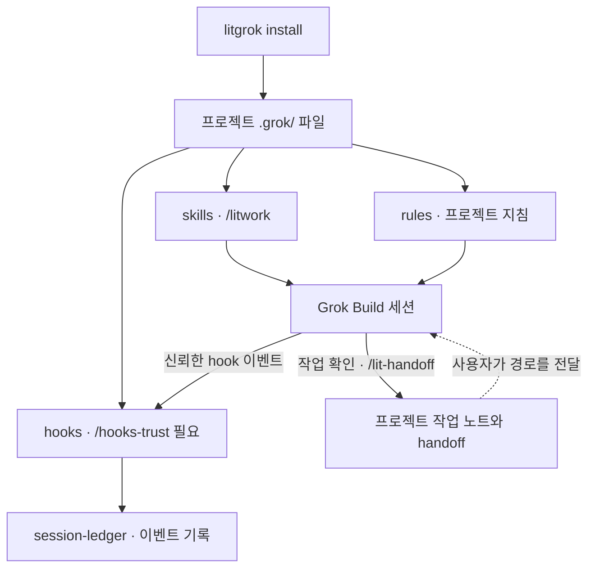

<p align="center"><picture><source media="(prefers-reduced-motion: reduce)" srcset="https://cdn.jsdelivr.net/npm/@litfamily/litgrok@1.0.9/docs/assets/cover-motion-still.webp" /><source media="(prefers-reduced-motion: no-preference)" srcset="https://cdn.jsdelivr.net/npm/@litfamily/litgrok@1.0.9/docs/assets/cover-motion.webp" /></picture></p>

<p align="center"></p>

<details>
<summary>ASCII 로고 복사</summary>

```text
                             ▄▄▄▄
                   ▗███▌   ▗██████▖
 ▗▄▄▄▄▄          ▗▟████▌   ▝██████▘
 ▐█████        ▗▟██████▌    ▝▀▜█▀▘
 ▐█████      ▗▟███████▄▄▄▄▄▄▄▄▄▄▄▄▄▄▄▄▄▄▄▄
 ▐█████    ▗▟█████████████████████████ ▐█▀
 ▐█████    ████████████████████████████▀
 ▐█████    ██▛▘   ▄ ▄▄▄▄▖▄▄▄▄▄▄▄▄▄▄▄▄▄▖
 ▐█████    ▀    ▄██ ████▌█████████████▌
 ▐█████       ▄████ ████▌█████████████▌
 ▐█████     ▄█████▛
 ▐█████  ▗▟█████▀▘       ▄▄▄▄▄     ▗▖
 ▐█████ ▐█████▀          █████     ▐▛▀
 ▐█████ ▐███▀            █████
 ▐█████ ▐█▀              █████
 ▐█████ ▝                █████
 ▐█████▄▄▄▄▄▄▄▖          █████
 ▐███████████▛           █████
 ▐██████████▀            █████


grok
```

</details>

<h1 align="center">LitGrok</h1>
<p align="center"><strong>Keep the work lit.</strong></p>

Grok Build에서 작은 결과물을 만들고, 확인한 내용과 다음 할 일을 프로젝트에 남기세요.

[English](https://cdn.jsdelivr.net/npm/@litfamily/litgrok@1.0.9/README.md) · [설치](#30초-설치) · [빠른 시작](#빠른-시작) · [스킬](#스킬-한눈에-보기) · [상세 안내](https://cdn.jsdelivr.net/npm/@litfamily/litgrok@1.0.9/docs/reference_ko-KR.md)

<p align="center">
<a href="#30초-설치"></a>
<a href="https://cdn.jsdelivr.net/npm/@litfamily/litgrok@1.0.9/LICENSE"></a>
</p>

<p align="center"><a href="https://cdn.jsdelivr.net/npm/@litfamily/litgrok@1.0.9/docs/reference_ko-KR.md"> 상세 안내</a> &nbsp; <a href="#30초-설치">설치</a> &nbsp; <a href="https://cdn.jsdelivr.net/npm/@litfamily/litgrok@1.0.9/docs/assets/cover-motion.webp"> 커버 모션</a> &nbsp; <a href="https://cdn.jsdelivr.net/npm/@litfamily/litgrok@1.0.9/LICENSE"> MIT</a></p>

## 30초 설치

Node.js와 Grok Build를 준비한 뒤 체험할 프로젝트의 대화형 터미널에서 실행하세요. 기본 설치는 scoped package를 사용합니다.

```bash
npm exec --yes --package @litfamily/litgrok@latest -- litgrok install
```

별도 체험을 하려면 로컬 패키지의 실제 절대 경로를 변수에 넣고 두 줄을 차례로 실행하세요.

```bash
LITGROK_PACK='/absolute/path/to/the-provided-package.tgz'
npm exec --yes --package "$LITGROK_PACK" -- litgrok install
```

기본 설치 위치는 `<project>/.grok/`입니다. 버전을 고정하려면 `--package @litfamily/litgrok@1.0.9`를 사용하세요. `--user`를 붙이면 `~/.grok/`에 설치합니다. [설치·업데이트 상세 안내](https://cdn.jsdelivr.net/npm/@litfamily/litgrok@1.0.9/docs/reference_ko-KR.md#설치).

Grok 상태 행의 지속 표시는 선택 사항이며 사용자 범위에서만 설정할 수 있습니다.

```bash
npm exec --yes --package @litfamily/litgrok@latest -- litgrok install --user --status-line
```

이 명령은 2초 간격으로 갱신되는 `[ui.status_line]`을 `~/.grok/config.toml`에 추가합니다. 기존 config를 바꾸기 전에 백업하며, 이미 `ui.status_line` 설정이 있으면 보존합니다. `uninstall --user`는 변경되지 않은 LitGrok 관리 값만 제거합니다. Grok은 이 설정을 사용자 또는 관리자 config에서 읽으며 project/plugin config에서는 읽지 않습니다 ([상태 행 문서](https://docs.x.ai/build/features/status-line), [설정 참조](https://docs.x.ai/build/settings/reference)). 예시는 `🔥 LIT IGNITED · lit-plan 🔥 │ grok-4 │ ctx 42%`와 `LIT · grok │ grok-4 │ ctx 42%`입니다. 본문에서 inline 또는 fenced Markdown code를 제외한 뒤 `lit-scientific-visualization`, `lit-handoff`, `autoconference`, `autoresearch`, `lit-plan`, `litwork` 중 처음 일치한 항목이 규율을 정하고, 단독 `lit`은 `litwork`로 표시합니다. 색상을 사용하면 활성 `LIT IGNITED · <discipline>` label을 굵은 글씨로 문자마다 truecolor gradient(`#FF6337 → #FF2D95 → #00E5FF`)를 적용하고, 불꽃 emoji와 model/context 구간은 색칠하지 않습니다. 빈 값을 포함한 `NO_COLOR` 또는 `LITGROK_HUD_COLOR=0`은 escape 없는 plain 행을 유지합니다. Grok Build 1.0.13 상태 행에서 truecolor, 굵은 글씨, emoji가 표시되는 것을 확인했습니다. 이 기능은 status command를 추가하며 hook 등록 수를 늘리지 않습니다. LitGrok에는 계속 11개 hook 등록이 있습니다.

### 안전과 제거

파일을 쓰기 전에 설치 경로를 확인하세요.

```bash
npm exec --yes --package "$LITGROK_PACK" -- litgrok install --dry-run
```

Installer는 업데이트·삭제 전에 파일 소유권을 확인합니다. 사용자가 수정했거나 소유권을 확인할 수 없는 파일, 안전하지 않은 경로가 있으면 작업을 거부합니다. `CI`, `NO_COLOR`(값이 비어 있어도 적용), `--no-color`, `--dry-run`은 `--yes`와 무관하게 항상 파일을 쓰지 않는 미리보기입니다. `--yes` 없이 실행한 비대화형 설치도 미리보기이며, `--yes`를 쓰면 위 조건이 없는 한 TTY 없이도 진행됩니다.

로컬 패키지로 설치했다면 같은 프로젝트에서 같은 패키지로 제거합니다. `--user` 설치만 제거할 때는 제거 명령에도 `--user`를 붙이세요.

```bash
npm exec --yes --package "$LITGROK_PACK" -- litgrok uninstall
```

레지스트리 제거 명령:

```bash
npm exec --yes --package @litfamily/litgrok@latest -- litgrok uninstall
npm exec --yes --package @litfamily/litgrok@latest -- litgrok uninstall --user
```

사용자 범위 제거는 `~/.grok/config.toml`을 먼저 백업하고, 변경되지 않은 LitGrok 관리 status-line key만 제거합니다. 다른 설정과 사용자가 수정한 status line은 보존합니다. 설치 범위와 같은 옵션으로 제거하세요. 업데이트는 `install`을 다시 실행합니다. Installer는 Git root를 만들거나 hook trust를 허용하거나 로그인 상태·API 키를 쓰거나 모델을 선택하지 않습니다. Hedge guard는 host 오류 시 fail-open으로 동작합니다. 패키지 테스트가 통과해도 live Grok 동작을 확인한 것은 아닙니다. Git root에서 현재 세션의 `/hooks`와 `grok inspect --json`을 확인하세요. [Host 경계와 검증](https://cdn.jsdelivr.net/npm/@litfamily/litgrok@1.0.9/docs/reference_ko-KR.md#검증).

## 빠른 시작

설치한 프로젝트의 Git root에서 Grok Build를 열거나 재시작합니다. `/hooks-trust`에서 project hook을 확인하고 신뢰하세요. 관찰된 Grok Build 1.0.23에서는 `grok --trust inspect --json`도 사용할 수 있지만 `--help`에는 이 global flag가 나오지 않습니다. 일반 폴더에서는 skill과 rule이 로드되어도 hook은 0개로 남을 수 있습니다. `/skills`에서 설치된 목록을, `/hooks`에서 hook 등록을 확인합니다. LitGrok은 Git root를 만들거나 trust를 바꾸지 않습니다.

외부 서비스나 기존 테스트가 필요 없는 작은 작업부터 시작하세요. Grok Build에 다음을 입력합니다.

```text
/litwork 외부 의존성 없이 index.html 하나로 할 일 목록을 만들어줘. 추가·완료·삭제 동작을 구현하고, 확인한 내용과 다음 할 일을 남겨줘. 브라우저를 자동으로 열지 말고 내가 확인할 순서를 알려줘.
```

생성된 `index.html`을 직접 열어 항목 추가, 완료 표시, 삭제를 확인하세요. 파일이 생겼다는 것과 동작을 확인했다는 것은 다릅니다. 실행하지 못한 검사는 미확인으로 남기고, 오류가 있으면 실제 결과를 세션에 알려주세요.

### 다음 세션으로 불씨 건네기

```text
계획하기 → 만들기 → 확인하기 → 다음 작업에 건네기
```

큰 변경이라면 `/lit-plan`으로 계획을 만들고 저장된 계획을 검토한 뒤 `/start-work <plan path>`를 호출하세요. 작업을 멈출 때는 다음처럼 요청할 수 있습니다.

```text
/lit-handoff 지금까지 만든 것, 확인한 것, 남은 일을 기록하고 저장 경로를 알려줘.
```

새 세션에서는 반환된 경로를 직접 지정해 문서를 읽고 현재 파일 상태부터 확인하도록 요청하세요. 기본 경로는 새 Git 프로젝트에서 `.handoff/HANDOFF.md`, Git이 없는 작업 폴더에서 `HANDOFF.md`입니다. 기존 루트 handoff가 있으면 그 파일을 사용합니다. [경로 선택과 인수인계 안내](https://cdn.jsdelivr.net/npm/@litfamily/litgrok@1.0.9/.grok/skills/lit-handoff/SKILL.md).

**불씨를 남긴다는 것은 다음에 이어갈 일을 기록한다는 뜻입니다.** Skill이 현재 세션의 작업 절차를 안내합니다. LitGrok이 백그라운드 작업을 예약하거나 세션이 끝난 뒤 작업을 계속하지는 않습니다.

## 주요 기능

> **불씨를 건네받았다. 이제, 당신의 작업에 옮길 차례다.**
>
> 고치고 싶은 버그 하나. 만들고 싶은 화면 하나. 끝내고 싶은 프로젝트 하나.
>
> 시작은 짧은 한 줄이면 됩니다. 세션이 바뀌면 어려운 건 어디까지 했는지 다시 짚는 일입니다. LIT은 목표와 계획, 확인한 결과, 다음에 할 일을 프로젝트에 남기는 작업을 안내합니다.
>
> **대화가 끝난 자리에서, 다음 작업이 시작되도록.**

skill 38개, agent 11개, project rule 하나, hook 등록 열한 개를 제공합니다. Installer가 프로젝트에 전체 파일을 복사하고, 세션 실행과 모델 선택은 Grok Build가 담당합니다.

긴 문서 편집이나 한국어 심층 교정에는 `lit-humanizer`를 사용하세요. PreToolUse guard는 새로 추가한 독자용 문장만 검사하며, 명확한 block 신호가 있으면 저장 전에 고쳐야 합니다. Warning 신호는 참고용입니다. 도구가 만든 DOCX와 PPTX는 생성 직후 검사하고, PDF는 `pdftotext`가 설치되어 있으면 검사합니다. 추출기를 사용할 수 없어도 파일은 그대로 두고 확인 범위를 알립니다.

브라우저 자동화 도구는 `npm run probe:browser-drive`로 확인합니다. LitGrok이 안내하는 CLI는 [agent-browser](https://github.com/vercel-labs/agent-browser)이며, LitGrok이 대신 설치하지는 않습니다. 없다는 결과가 나오면 사용자가 `npm install -g agent-browser`와 `agent-browser install`을 실행하세요.

패키지: `@litfamily/litgrok` · 버전: `1.0.9` · [MIT](https://cdn.jsdelivr.net/npm/@litfamily/litgrok@1.0.9/LICENSE)

과학 시각화 corpus는 `.grok/vendor/scientific-visualization/`에 포함되며, 숫자 `045_scientific-visualization` 표기는 라이선스와 provenance 파일명에만 남습니다.

이 경로 예시는 정적 안내이며 실제 호스트 동작을 증명하지 않습니다.

다섯 activation 계약은 모델이 활성 응답을 다른 내용보다 먼저 한 줄로 시작하도록 요청합니다. `/litwork`에서 요청하는 줄은 다음과 같습니다.

🔥 **LIT IGNITED · litwork** 🔥

이는 advisory prompt 지침이며 native host 표시 여부를 확인하지 않습니다.

유지된 `docs/assets/cover.svg`는 편집 가능한 벡터 원본이며, 이 README는 동작 감소를 선호할 때 모션 커버의 정지 프레임을 표시합니다.

### Grok Build 안에서 연결되는 것들

Installer는 프로젝트의 `.grok/`에 파일을 놓습니다. `/litwork`는 현재 세션에서 따를 작업 절차를 안내하고, 실제 실행과 모델 선택은 Grok Build가 맡습니다. 아래는 주요 연결 관계입니다.



Hook의 `.grok/litgrok/session-ledger/`는 이벤트가 발생한 순서를 남깁니다. 작업 성공 여부는 결과물과 확인 기록으로 판단하세요. 다음 세션에서는 사용자가 handoff 경로를 전달합니다. 기록이 있다고 작업이 자동으로 재개되지는 않습니다.

[작업 절차와 hook의 범위](https://cdn.jsdelivr.net/npm/@litfamily/litgrok@1.0.9/.grok/skills/litwork/SKILL.md) · [인수인계 경로](https://cdn.jsdelivr.net/npm/@litfamily/litgrok@1.0.9/.grok/skills/lit-handoff/SKILL.md) · [설치 상세](https://cdn.jsdelivr.net/npm/@litfamily/litgrok@1.0.9/docs/reference_ko-KR.md#설치)

### 화면과 README 제작

`/frontend-ui-ux <화면과 목표>`는 요청 범위의 화면을 구현하고 렌더링을 확인합니다. 충분한 요구사항이면 바로 제작하고, 중요한 방향이 불명확할 때만 질문합니다. 검토·계획 전용 요청에서는 파일을 수정하지 않습니다.

개념·기술 다이어그램에는 `/lit-diagram-drawer` skill을 사용합니다. 정확한 slash 경로는 Grok Build에서 확인하기 전까지 후보이며, `/skills`에서 skill을 찾을 수 있습니다. 일반 화면은 `/frontend-ui-ux`, 측정 데이터 그래프는 `/lit-scientific-visualization` 범위입니다.

슬라이드 런타임에는 Node.js 20.9 이상이 필요합니다. DOCX와 기본 설치 기능은 별도로 동작합니다.
발표자료는 `lit-pptx`, 보고서와 워드 문서는 `lit-docx`를 사용합니다. 맨 끝의 `lit` 요청은 project rule이 문서·발표 표현을 보고 하나 또는 둘 다 고르도록 안내합니다. 슬라이드 기본값은 AZURE-PRO와 Pretendard, 한국어 문서 기본값은 korean-generic입니다. 엔진, 템플릿, 품질 검사와 첫 사용 시 고정된 의존성을 캐시에 설치하는 도구가 포함됩니다. 정확한 명령과 선택적 렌더 도구는 각 skill 문서를 보세요. 실제 Grok 세션 전에는 선택 여부가 확인되지 않습니다.

`/readme-studio <저장소와 목표>`는 저장소 사실에 근거한 README, Pretendard/Meslo 윤곽선 글자와 커버·모션 소스를 만듭니다. 설치 후 `/skills`에서 확인하세요. 이미지 도구가 없으면 `IMAGE_GENERATION_UNAVAILABLE`을 알리고 명시적으로 제공된 배경으로 제작할 수 있습니다. 폰트와 렌더러는 작업 폴더에서 준비합니다. 로컬 결과는 실제 호스트 동작 및 GitHub/npm 게시 후 검증과 구분합니다.

커버의 모션은 LitFamily 모션 skill로 만든 브랜드 연출이며, 실제 Grok 작업 실행을 녹화한 영상이 아닙니다.

## 스킬 한눈에 보기

skill 38개를 한 줄씩 정리했습니다. 경로는 각 skill 문서에 적힌 것이고, 현재 Grok Build 세션에 로드된 목록은 `/skills`에서 확인하세요. 이전 이름을 한 릴리스 동안 별칭으로 유지하는 정책은 [이름 변경과 호환성](https://cdn.jsdelivr.net/npm/@litfamily/litgrok@1.0.9/docs/reference_ko-KR.md#skill-이름-변경과-호환성)을 보세요. 이전 slash 경로는 보장되지 않습니다.

<table>
<tr><th>이렇게 됩니다</th><th>스킬</th><th>얻는 것</th></tr>
<tr>
<td></td>
<td><code>litwork</code><br /><sub><code>/litwork &lt;goal&gt;</code></sub></td>
<td>작업을 범위가 정해진 체크리스트로 바꿉니다. LitGrok 훅이 단계마다 로컬 기록을 남깁니다.</td>
</tr>
<tr>
<td></td>
<td><code>lit-plan</code><br /><sub><code>/lit-plan &lt;objective&gt;</code></sub></td>
<td><code>/start-work</code>가 실행할 번호 붙은 작업 목록을 파일로 만듭니다. 코드는 아직 건드리지 않습니다.</td>
</tr>
<tr>
<td></td>
<td><code>start-work</code><br /><sub><code>/start-work &lt;plan path&gt;</code></sub></td>
<td>계획을 한 줄씩 실행합니다. A부터 F까지 관문을 모두 통과해야 체크됩니다.</td>
</tr>
<tr>
<td></td>
<td><code>review-work</code><br /><sub><code>/review-work &lt;target&gt;</code></sub></td>
<td>읽기 전용 리뷰 여섯 갈래가 찾은 문제를 증거 순으로 정리합니다.</td>
</tr>
<tr>
<td></td>
<td><code>litgoal</code><br /><sub><code>/litgoal &lt;request&gt;</code></sub></td>
<td>확인 가능한 목표 하나를 다듬어, 직접 실행할 <code>/goal</code> 한 줄을 건넵니다. LitGrok은 목표 상태를 저장하지 않습니다.</td>
</tr>
<tr>
<td></td>
<td><code>lit-recap</code><br /><sub><code>/lit-recap</code></sub></td>
<td>Grok Build 세션 기록을 바탕으로 증거가 붙은 짧은 요약을 만듭니다.</td>
</tr>
<tr>
<td></td>
<td><code>lit-handoff</code><br /><sub><code>handoff</code> · <code>/lit-handoff</code></sub></td>
<td><code>handoff</code>라고 치면 다음 세션이 읽을 인수인계 파일을 만듭니다. 비밀 값은 넣지 않습니다.</td>
</tr>
<tr>
<td></td>
<td><code>deep-interview</code><br /><sub><code>/deep-interview &lt;request&gt;</code></sub></td>
<td>정해진 순서로 한 번에 한 질문씩 물어, 계획을 세울 수 있을 만큼 요청을 분명히 합니다.</td>
</tr>
<tr>
<td></td>
<td><code>litresearch</code><br /><sub><code>/litresearch &lt;question&gt;</code></sub></td>
<td>범위를 정한 조사입니다. 모든 주장에 출처를 붙이고, 증거보다 크게 말하지 않습니다.</td>
</tr>
<tr>
<td></td>
<td><code>lit-crucible</code><br /><sub><code>/lit-crucible &lt;approach&gt;</code></sub></td>
<td>계획 전에 요구사항을 반박해 봅니다. 반박을 견딘 위험만 계획으로 넘어갑니다.</td>
</tr>
<tr>
<td></td>
<td><code>lit-init</code><br /><sub><code>/lit-init &lt;path&gt;</code></sub></td>
<td>있는 안내 문서를 찾아 충돌과 빈 곳을 알려주고 배치를 제안합니다. 승인 전에는 아무것도 쓰지 않습니다.</td>
</tr>
<tr>
<td></td>
<td><code>lit-comprehend</code><br /><sub><code>/lit-comprehend &lt;scope&gt;</code></sub></td>
<td>에이전트가 쓴 작업을 이해하도록 돕는 설명 페이지입니다. 직관, 흐름 설명, 짧은 퀴즈 순서입니다.</td>
</tr>
<tr>
<td></td>
<td><code>lit-humanizer</code><br /><sub><code>/lit-humanizer &lt;draft or file&gt;</code></sub></td>
<td>딱딱한 AI 문장을 한국어나 영어로 다시 씁니다. 사실과 단서는 남기고 군더더기는 뺍니다.</td>
</tr>
<tr>
<td></td>
<td><code>lit-diagram-drawer</code><br /><sub><code>/lit-diagram-drawer &lt;brief&gt;</code></sub></td>
<td>슬라이드와 문서에 넣을 다이어그램을 편집 가능한 형태로 그리고, 검사한 뒤 PNG와 SVG로 내보냅니다.</td>
</tr>
<tr>
<td></td>
<td><code>lit-pptx</code><br /><sub><code>/lit-pptx &lt;presentation request&gt;</code></sub></td>
<td>편집 가능한 PowerPoint 발표자료와 원고 Markdown을 만듭니다. 기본은 AZURE-PRO와 Pretendard이고, 파일에 품질 검사를 돌리며 LibreOffice가 있으면 슬라이드도 확인합니다.</td>
</tr>
<tr>
<td></td>
<td><code>lit-docx</code><br /><sub><code>/lit-docx &lt;document request&gt;</code></sub></td>
<td>서식을 갖춘 Word 문서와 원고 Markdown을 만듭니다. 한국어 보고서는 korean-generic 서식을 쓰고, 문체 검사와 DOCX 점검을 돌리며 LibreOffice가 있으면 페이지도 확인합니다.</td>
</tr>
<tr>
<td></td>
<td><code>frontend-ui-ux</code><br /><sub><code>/frontend-ui-ux &lt;surface and outcome&gt;</code></sub></td>
<td>실제로 동작하는 화면을 만들고, 프로브로 일곱 가지 보기를 렌더링합니다. 네 가지 폭, 다크 모드, 모션 줄이기, 200% 확대입니다.</td>
</tr>
<tr>
<td></td>
<td><code>readme-studio</code><br /><sub><code>/readme-studio &lt;repository and outcome&gt;</code></sub></td>
<td>사실에 맞는 README와 커버, 윤곽선 글자, 로컬 모션을 만듭니다.</td>
</tr>
<tr>
<td></td>
<td><code>lit-typographic-motion</code><br /><sub><code>/lit-typographic-motion &lt;request&gt;</code></sub></td>
<td>트리트먼트로 짧은 영상을 완성합니다. LitGrok의 타입 엔진이나 무대 캡처로 렌더링하고, 품질 검사를 거칩니다.</td>
</tr>
<tr>
<td></td>
<td><code>lit-scientific-visualization</code><br /><sub><code>/lit-scientific-visualization</code></sub></td>
<td>검증된 데이터로 논문용 그림과 캡션을 만듭니다. 그래프 종류는 데이터 성격에 맞춰 고릅니다.</td>
</tr>
<tr>
<td></td>
<td><code>lit-team</code><br /><sub><code>/lit-team</code></sub></td>
<td>작업을 범위가 정해진 묶음으로 나눠 Grok Build 기본 서브에이전트에 맡깁니다. 통합과 검증은 부모가 맡습니다.</td>
</tr>
<tr>
<td></td>
<td><code>autoresearch</code><br /><sub><code>/autoresearch &lt;mode&gt; &lt;objective&gt;</code></sub></td>
<td>범위를 정한 연구 작업입니다. 서브에이전트가 조사하고, 증거 관문을 거쳐, 하나로 종합합니다.</td>
</tr>
<tr>
<td></td>
<td><code>autoconference</code><br /><sub><code>/autoconference &lt;mode&gt; &lt;topic&gt;</code></sub></td>
<td>서브에이전트들이 증거를 두고 논의하고, 종합에는 반대 의견도 남깁니다.</td>
</tr>
<tr>
<td></td>
<td><code>wikify</code><br /><sub><code>/wikify &lt;mode&gt;</code></sub></td>
<td>출처가 붙은 프로젝트 지식 지도를 <code>.grok/</code> 아래에 둡니다.</td>
</tr>
<tr>
<td></td>
<td><code>debugging</code><br /><sub><code>/debugging &lt;symptom&gt;</code></sub></td>
<td>버그를 재현하고, 가설을 세 개 이상 세워 확인한 뒤, 확인된 원인만 고칩니다.</td>
</tr>
<tr>
<td></td>
<td><code>refactor</code><br /><sub><code>/refactor &lt;target&gt;</code></sub></td>
<td>분리된 작업 트리에서 코드 구조를 바꿉니다. 동작은 테스트로 고정합니다.</td>
</tr>
<tr>
<td></td>
<td><code>lit-burnoff</code><br /><sub><code>/lit-burnoff &lt;scope&gt;</code></sub></td>
<td>테스트로 동작을 먼저 묶어 두고, 변경분에 붙은 AI식 군더더기를 걷어냅니다.</td>
</tr>
<tr>
<td></td>
<td><code>lit-burnoff-file</code><br /><sub><code>/lit-burnoff-file &lt;path&gt;</code></sub></td>
<td>파일 하나에서 생성된 문장 습관을 걷어내고 변경분을 확인합니다.</td>
</tr>
<tr>
<td></td>
<td><code>lit-code</code><br /><sub><code>/lit-code &lt;task&gt;</code></sub></td>
<td>엄격한 구현 규칙입니다. 테스트 먼저, 경계에서 타입 확인, 작은 파일.</td>
</tr>
<tr>
<td></td>
<td><code>lit-commit</code><br /><sub><code>/lit-commit &lt;operation&gt;</code></sub></td>
<td>변경을 저장소 스타일에 맞는 작은 커밋으로 나눕니다. 관계없는 작업은 건드리지 않습니다.</td>
</tr>
<tr>
<td></td>
<td><code>lsp</code><br /><sub><code>/lsp</code></sub></td>
<td>기본으로 꺼져 있는 Grok Build 내장 LSP 코드 분석 도구를 켜고 씁니다.</td>
</tr>
<tr>
<td></td>
<td><code>lsp-setup</code><br /><sub><code>/lsp-setup &lt;path or extension&gt;</code></sub></td>
<td>Grok Build가 볼 수 있는 언어 서버를 확인하고, 진단이 안 보일 때 대안을 알려줍니다.</td>
</tr>
<tr>
<td></td>
<td><code>structural-search</code><br /><sub><code>/structural-search &lt;pattern&gt;</code></sub></td>
<td>검색, 읽기, 선택적 LSP 참조로 코드 구조를 추적합니다. 없는 엔진을 지어내지 않습니다.</td>
</tr>
<tr>
<td></td>
<td><code>visual-qa</code><br /><sub><code>/visual-qa &lt;target&gt;</code></sub></td>
<td>렌더링된 화면을 스크린샷 근거로 검토합니다.</td>
</tr>
<tr>
<td></td>
<td><code>browser-drive</code><br /><sub><code>/browser-drive &lt;url&gt;</code></sub></td>
<td>브라우저 드라이버를 먼저 확인한 뒤 실제 페이지를 조작합니다. 드라이버가 없으면 그렇다고 말합니다.</td>
</tr>
<tr>
<td></td>
<td><code>comment-checker</code><br /><sub><code>/comment-checker &lt;path&gt;</code></sub></td>
<td>수정으로 추가된 주석을 검토합니다. 이유를 설명하는 주석은 남기고, 코드를 되풀이하는 주석은 뺍니다.</td>
</tr>
<tr>
<td></td>
<td><code>rules</code><br /><sub><code>/rules</code></sub></td>
<td>이 폴더에서 Grok Build가 어떤 안내를 어떤 순서로 읽는지, 훅을 신뢰하는지 설명합니다.</td>
</tr>
<tr>
<td></td>
<td><code>litgrok</code><br /><sub><code>/litgrok</code></sub></td>
<td>LitGrok 패키지가 무엇을 설치하고 무엇을 설치하지 않는지 설명합니다.</td>
</tr>
</table>

## 명령과 hook 표

### 프롬프트와 경로

Grok Build에서는 명시적인 `/litwork` 경로로 작은 작업을 시작합니다. 모델 실행은 호스트가 담당하고 LitGrok은 프로젝트에 skill, rule, 확인한 다음 단계를 남깁니다.

| 프롬프트 또는 경로 | 효과 |
| --- | --- |
| `/litwork` | Grok Build의 제공된 작업 체크리스트를 시작합니다. |
| `handoff` 또는 `/lit-handoff` | 확인한 결과와 다음 할 일을 다음 세션으로 건넵니다. |
| `/lit-plan` | 확인 기준이 있는 계획을 작성합니다. |
| `/start-work <승인된 계획>` | 승인한 계획을 실행합니다. |
| `/review-work` | 변경과 근거를 검토합니다. |
| `/litresearch` | 출처를 추적할 수 있는 범위 있는 조사를 하고 근거를 과장하지 않습니다. |

### Project hook

| 표면 | 등록과 경계 |
| --- | --- |
| Project hook | [`hooks/hooks.json`](https://cdn.jsdelivr.net/npm/@litfamily/litgrok@1.0.9/hooks/hooks.json)에 열한 개 등록이 있습니다. 신뢰한 Git root와 `/hooks-trust`가 필요하며, 일반 폴더에서는 skill과 rule만 로드되고 hook은 없을 수 있습니다. |

## 문제 해결

### Project hook

Project hook은 Grok Build에서 신뢰한 Git 프로젝트 루트가 있어야 발견됩니다. 일반 폴더에서도 설치된 skill과 rule은 로드될 수 있지만 hook은 0개로 남을 수 있습니다. 새 disposable project라면 사용자가 직접 `git init`을 실행한 뒤 trust를 허용하세요. 기존 저장소라면 실제 root에서 Grok Build를 여세요. Installer는 `git init`을 실행하거나 trust를 바꾸지 않습니다. 관찰된 Grok Build 1.0.23에서는 `grok --trust inspect --json`이 동작했지만 `grok --help`에는 global `--trust`가 표시되지 않았습니다. 이는 이 버전에서 확인한 동작입니다.

### 설치 미리보기

`CI`나 `NO_COLOR`가 설정되어 있으면 값이 비어 있어도 설치는 파일을 쓰지 않는 미리보기로 끝납니다. `--no-color`도 같습니다. `--yes` 없이 실행한 비대화형 설치도 미리보기이며, `--yes`를 쓰면 위 조건이 없는 한 TTY 없이도 설치가 진행됩니다. 설치 메시지에서 파일이 쓰였는지 확인한 뒤 다음 단계로 넘어가세요.

**상태 행이 보이지 않을 때:** 지속 상태 행은 선택 기능이며 사용자 또는 관리자 설정을 사용합니다. project/plugin 설정에서는 이 값을 읽지 않습니다. [상태 행 안내](https://docs.x.ai/build/features/status-line)를 확인하세요.

호스트 한계와 확인 절차는 [상세 안내](https://cdn.jsdelivr.net/npm/@litfamily/litgrok@1.0.9/docs/reference_ko-KR.md#검증)를 참고하세요.

## 링크

- [상세 안내](https://cdn.jsdelivr.net/npm/@litfamily/litgrok@1.0.9/docs/reference_ko-KR.md): 설치, hook, 터미널 출력, 패키지 검증, 출처.
- [Project rule](https://cdn.jsdelivr.net/npm/@litfamily/litgrok@1.0.9/.grok/rules/00-litgrok.md)과 [skill 목록](https://github.com/wjgoarxiv/litgrok/tree/main/.grok/skills).
- [변경 이력](https://cdn.jsdelivr.net/npm/@litfamily/litgrok@1.0.9/CHANGELOG.md)과 [라이선스](https://cdn.jsdelivr.net/npm/@litfamily/litgrok@1.0.9/LICENSE).

- [기여 안내](https://cdn.jsdelivr.net/npm/@litfamily/litgrok@1.0.9/CONTRIBUTING.md), [보안](https://cdn.jsdelivr.net/npm/@litfamily/litgrok@1.0.9/SECURITY.md), [행동 규범](https://cdn.jsdelivr.net/npm/@litfamily/litgrok@1.0.9/CODE_OF_CONDUCT.md), [지원](https://cdn.jsdelivr.net/npm/@litfamily/litgrok@1.0.9/SUPPORT.md).
- [개인정보와 로컬 데이터](https://cdn.jsdelivr.net/npm/@litfamily/litgrok@1.0.9/docs/privacy.md), [기존 npm 이름에서 이전](https://cdn.jsdelivr.net/npm/@litfamily/litgrok@1.0.9/docs/reference_ko-KR.md#npm-package-migration).

### LITFAMILY

상단 모션 커버에는 다섯 제품을 나타내는 장갑 로봇이 있습니다. 각 제품은 자기 호스트에서 독립적으로 동작하며 함께 설치하거나 서로 연결할 필요가 없습니다.
