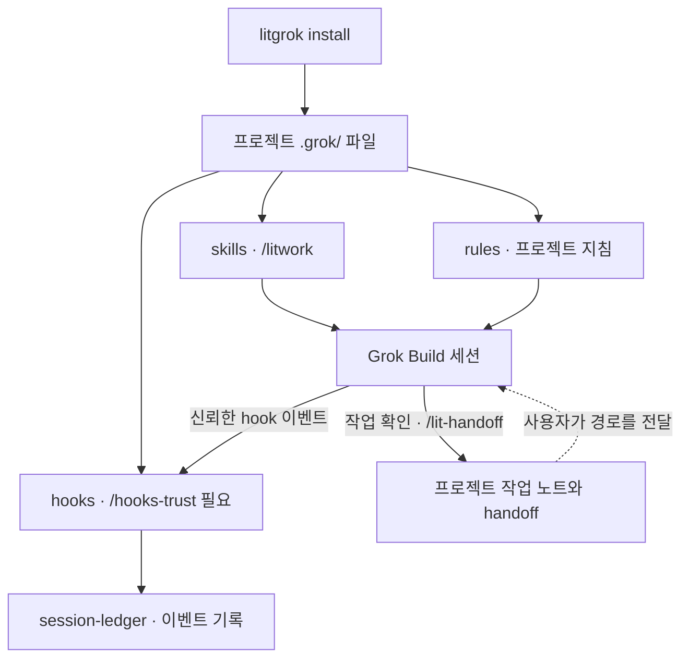

<p align="center"><picture><source media="(prefers-reduced-motion: reduce)" srcset="./docs/assets/cover-motion-still.webp" /><source media="(prefers-reduced-motion: no-preference)" srcset="./docs/assets/cover-motion.webp" /></picture></p>

<p align="center"></p>

<details>
<summary>ASCII 로고 복사</summary>

```text
                             ▄▄▄▄
                   ▗███▌   ▗██████▖
 ▗▄▄▄▄▄          ▗▟████▌   ▝██████▘
 ▐█████        ▗▟██████▌    ▝▀▜█▀▘
 ▐█████      ▗▟███████▄▄▄▄▄▄▄▄▄▄▄▄▄▄▄▄▄▄▄▄
 ▐█████    ▗▟█████████████████████████ ▐█▀
 ▐█████    ████████████████████████████▀
 ▐█████    ██▛▘   ▄ ▄▄▄▄▖▄▄▄▄▄▄▄▄▄▄▄▄▄▖
 ▐█████    ▀    ▄██ ████▌█████████████▌
 ▐█████       ▄████ ████▌█████████████▌
 ▐█████     ▄█████▛
 ▐█████  ▗▟█████▀▘       ▄▄▄▄▄     ▗▖
 ▐█████ ▐█████▀          █████     ▐▛▀
 ▐█████ ▐███▀            █████
 ▐█████ ▐█▀              █████
 ▐█████ ▝                █████
 ▐█████▄▄▄▄▄▄▄▖          █████
 ▐███████████▛           █████
 ▐██████████▀            █████


grok
```

</details>

<h1 align="center">LitGrok</h1>
<p align="center"><strong>Keep the work lit.</strong></p>

Grok Build에서 작은 결과물을 만들고, 확인한 내용과 다음 할 일을 프로젝트에 남기세요.

[English](./README.md) · [설치](#30초-설치) · [빠른 시작](#빠른-시작) · [스킬](#스킬-한눈에-보기) · [상세 안내](./docs/reference_ko-KR.md)

<p align="center">
<a href="#30초-설치"></a>
<a href="./LICENSE"></a>
</p>

<p align="center"><a href="./docs/reference_ko-KR.md"> 상세 안내</a> &nbsp; <a href="#30초-설치">설치</a> &nbsp; <a href="./docs/assets/cover-motion.webp"> 커버 모션</a> &nbsp; <a href="./LICENSE"> MIT</a></p>

## 왜 만들었나요

> **불씨를 건네받았다. 이제, 당신의 작업에 옮길 차례다.**
>
> 고치고 싶은 버그 하나. 만들고 싶은 화면 하나. 끝내고 싶은 프로젝트 하나.
>
> 시작은 짧은 한 줄이면 됩니다. 세션이 바뀌면 어디까지 했는지 다시 짚기가 어렵습니다. LIT은 목표와 계획, 확인한 결과, 다음에 할 일을 프로젝트에 남기는 작업을 안내합니다.
>
> **대화가 끝난 자리에서, 다음 작업이 시작되도록.**

세션을 돌리고 모델을 고르는 일은 Grok Build가 합니다. LitGrok은 그 위에서 계획하고, 만들고, 확인하고, 어디서 멈췄는지 적어 두는 흐름을 더합니다.

설치 프로그램이 스킬 38개, 에이전트 11개, 프로젝트 규칙 하나, 훅 등록 열한 개를 프로젝트에 통째로 복사합니다.

## 30초 설치

Node.js와 Grok Build가 있으면 됩니다. 써 보고 싶은 프로젝트에서 대화형 터미널을 열고 다음을 실행하세요.

```bash
npm exec --yes --package @litfamily/litgrok@latest -- litgrok install
```

파일은 `<project>/.grok/`에 들어갑니다. 사용자 홈(`~/.grok/`)에 설치하려면 `--user`를 붙이고, 이 릴리스로 고정하려면 `--package @litfamily/litgrok@1.0.11`을 쓰세요. [설치·업데이트 상세 안내](./docs/reference_ko-KR.md#설치)

로컬 패키지로 써 보려면 실제 절대 경로를 변수에 넣고 두 줄을 따로 실행하세요.

```bash
LITGROK_PACK='/absolute/path/to/the-provided-package.tgz'
npm exec --yes --package "$LITGROK_PACK" -- litgrok install
```

### 상태 행 켜기 (선택)

원하면 Grok 화면에 LitGrok 상태 행을 띄워 둘 수 있습니다. 마지막 프롬프트로 어떤 LitGrok 스킬이 시작됐는지, 어떤 모델인지, 컨텍스트를 얼마나 썼는지가 한 줄에 보입니다. 사용자 설정에 들어가는 값이라, 사용자 범위로 설치할 때 켜야 합니다.

```bash
npm exec --yes --package @litfamily/litgrok@latest -- litgrok install --user --status-line
```

이 명령은 `~/.grok/config.toml`에 `[ui.status_line]` 항목을 넣고, 상태 행은 2초마다 새로 고쳐집니다. 파일을 바꾸기 전에는 먼저 백업하고, 직접 설정한 상태 행이 이미 있으면 파일을 그대로 둡니다. 나중에 `--user`로 제거하면 LitGrok이 넣은 값만 지우고, 사용자가 직접 고친 값은 그대로 둡니다.

Grok은 이 설정을 사용자나 관리자 설정에서만 읽고, 프로젝트나 플러그인 설정은 보지 않습니다. 그래서 프로젝트 설치로는 켤 수 없습니다([상태 행 문서](https://docs.x.ai/build/features/status-line), [설정 참조](https://docs.x.ai/build/settings/reference)).

<details>
<summary>상태 행에 보이는 내용</summary>

LitGrok 스킬이 동작 중일 때는 `🔥 LIT IGNITED · lit-plan 🔥 │ grok-4 │ ctx 42%`처럼, 그 밖에는 `LIT · grok │ grok-4 │ ctx 42%`처럼 보입니다.

어떤 이름이 뜰지는 가장 최근 프롬프트가 정합니다. 프롬프트에서 `lit-scientific-visualization`, `lit-handoff`, `autoconference`, `autoresearch`, `lit-plan`, `litwork` 가운데 가장 먼저 나오는 이름이 표시되고, `lit`만 쓰면 `litwork`로 보입니다. 인라인 코드나 코드 블록 안에 든 이름은 세지 않으니, 코드 조각을 붙여 넣어도 표시는 바뀌지 않습니다.

색상을 켜 두면 `LIT IGNITED · <discipline>` 부분이 굵은 글씨가 되고, 글자마다 주황빛 빨강에서 분홍을 거쳐 청록으로 이어지는 트루컬러 그라데이션(`#FF6337 → #FF2D95 → #00E5FF`)이 입혀집니다. 불꽃 이모지와 모델·컨텍스트 부분은 색 없이 둡니다. 색을 아예 빼고 싶다면 Grok 실행 환경에 `NO_COLOR`(빈 값이어도 됩니다)나 `LITGROK_HUD_COLOR=0`을 설정하세요. Grok Build 1.0.13에서는 상태 행에 트루컬러와 굵은 글씨, 이모지가 모두 제대로 나왔습니다.

상태 행은 별도의 상태 명령으로 돌기 때문에 훅 등록은 그대로 열한 개입니다.

</details>

### 안전하게 설치하고 지우기

실제로 쓰기 전에 어느 경로에 파일이 들어가는지 보려면 `--dry-run`을 붙이세요.

```bash
npm exec --yes --package @litfamily/litgrok@latest -- litgrok install --dry-run
```

설치 프로그램은 파일을 업데이트하거나 지우기 전에 자기가 설치한 파일인지부터 확인합니다. 직접 고친 파일, 다른 도구가 둔 파일, 심볼릭 링크처럼 안전하지 않은 경로가 하나라도 있으면 아무 파일도 쓰기 전에 작업 전체를 멈추고, 어떤 파일 때문인지 알려 줍니다.

어떤 때는 미리보기만 하고 끝납니다. 무엇을 할지 보여 준 뒤 `no files written`을 출력하고 멈추는데, `--yes`를 붙여도 다음 경우에는 그렇습니다.

- `--dry-run`: 먼저 계획만 보겠다고 한 경우입니다.
- `--no-color`를 붙였거나 환경에 `NO_COLOR`가 있는 경우입니다. 값이 비어 있어도 마찬가지이니, 실제로 설치하려면 이 변수를 지우세요.
- 환경에 `CI`가 있는 경우입니다. CI 작업에서는 늘 미리보기로 끝납니다.

`--yes` 없이 스크립트나 파이프처럼 터미널이 연결되지 않은 곳에서 실행해도 미리보기입니다. 스크립트에서 실제로 설치하려면 `--yes`를 붙이세요. 위 경우에 해당하지 않으면 터미널 없이도 설치가 진행됩니다.

제거는 설치한 방식 그대로 합니다. 프로젝트에 설치했다면 그대로, 사용자 범위에 설치했다면 `--user`를 붙여 실행하세요.

```bash
npm exec --yes --package @litfamily/litgrok@latest -- litgrok uninstall
npm exec --yes --package @litfamily/litgrok@latest -- litgrok uninstall --user
```

로컬 패키지로 설치했다면 같은 프로젝트에서 같은 패키지로 지웁니다.

```bash
npm exec --yes --package "$LITGROK_PACK" -- litgrok uninstall
```

사용자 범위에서 제거할 때는 먼저 `~/.grok/config.toml`을 백업한 뒤, LitGrok이 넣고 손대지 않은 상태 행 값만 지웁니다. 다른 설정은 건드리지 않습니다. 업데이트는 `install`을 다시 실행하면 됩니다.

몇 가지는 사용자 몫으로 남겨 둡니다. 훅 신뢰, Git 루트 만들기, 로그인, 모델 선택은 모두 Grok Build에서 하는 일이라 설치 프로그램은 손대지 않고, API 키도 건드리지 않습니다. 훅 가운데 얼버무림 검사는 결과물에 모호하게 둘러대는 표현이 들어가기 전에 막아 줍니다. 다만 호스트 쪽에서 오류가 나면 막지 않고 그대로 통과시킵니다. 패키지 테스트는 배포하는 파일을 검사합니다. 지금 세션이 실제로 무엇을 불러왔는지는 저장소 루트에서 Grok Build를 열고 `/hooks`와 `grok inspect --json`으로 확인하세요. [호스트 경계와 검증](./docs/reference_ko-KR.md#검증)

## 빠른 시작

LitGrok을 설치한 프로젝트의 Git 루트에서 Grok Build를 열거나 다시 시작합니다. Grok은 신뢰한 프로젝트 훅만 실행하니, `/hooks-trust`에서 훅을 살펴보고 신뢰해 주세요. Grok Build 1.0.23에서는 명령줄에서 `grok --trust inspect --json`으로도 같은 일을 할 수 있었습니다. 아직 Git 저장소가 아닌 폴더라면 먼저 직접 `git init`을 실행하세요. 일반 폴더에서는 스킬과 규칙은 불러와도 훅은 하나도 잡히지 않을 수 있습니다.

그다음 `/skills`에서 설치된 스킬 목록을, `/hooks`에서 훅 등록을 확인합니다.

처음에는 외부 서비스나 기존 테스트가 필요 없는 작은 작업이 좋습니다. Grok Build에 다음을 보내 보세요.

```text
/litwork 외부 의존성 없이 index.html 하나로 할 일 목록을 만들어줘. 추가·완료·삭제 동작을 구현하고, 확인한 내용과 다음 할 일을 남겨줘. 브라우저를 자동으로 열지 말고 내가 확인할 순서를 알려줘.
```

그다음 `index.html`을 직접 열어 항목을 추가하고, 완료로 표시하고, 지워 보세요. 이렇게 직접 눌러 보는 것이 진짜 확인입니다. 해 보지 못한 검사는 미확인으로 남겨 두고, 뭔가 깨지면 오류 메시지를 그대로 세션에 붙여 넣으세요.

### 다음 세션으로 불씨 건네기

```text
계획하기 → 만들기 → 확인하기 → 다음 작업에 건네기
```

큰 변경이라면 `/lit-plan`으로 계획을 만들고, 저장된 계획을 읽어 본 뒤 `/start-work <plan path>`를 실행하세요. 멈추기 전에는 이렇게 요청합니다.

```text
/lit-handoff 지금까지 만든 것, 확인한 것, 남은 일을 기록하고 저장 경로를 알려줘.
```

다음 세션에서는 돌려받은 경로를 Grok Build에 알려 주고, 그 문서를 읽은 뒤 현재 파일 상태부터 확인하라고 요청하세요. 인수인계 문서는 새 Git 프로젝트라면 `.handoff/HANDOFF.md`, Git이 없는 폴더라면 `HANDOFF.md`에 저장됩니다. 루트에 인수인계 문서가 이미 있으면 그 파일을 씁니다. [경로 선택과 인수인계 안내](./.grok/skills/lit-handoff/SKILL.md)

이 과정은 모두 지금 세션 안에서 스킬의 안내를 따라 진행되고, LitGrok이 백그라운드에서 따로 돌리는 작업은 없습니다. 세션이 끝나면 작업도 그 자리에서 멈추고, 다음 세션이 인수인계 문서를 받아 다시 이어 갑니다.

## 스킬 한눈에 보기

스킬 38개를 한 줄씩 정리했습니다. 경로는 각 스킬 문서에 적힌 것이고, 지금 Grok Build 세션이 실제로 불러온 목록은 `/skills`에서 보입니다. 이름이 바뀐 스킬은 한 릴리스 동안 이전 이름을 별칭으로 유지합니다([이름 변경과 호환성](./docs/reference_ko-KR.md#skill-이름-변경과-호환성)). 예전 슬래시 경로는 동작하지 않을 수도 있습니다.

<table>
<tr><th>이렇게 됩니다</th><th>스킬</th><th>얻는 것</th></tr>
<tr>
<td></td>
<td><code>litwork</code><br /><sub><code>/litwork &lt;goal&gt;</code></sub></td>
<td>작업을 범위가 정해진 체크리스트로 바꿉니다. LitGrok 훅이 단계마다 로컬 기록을 남깁니다.</td>
</tr>
<tr>
<td></td>
<td><code>lit-plan</code><br /><sub><code>/lit-plan &lt;objective&gt;</code></sub></td>
<td><code>/start-work</code>가 실행할 번호 붙은 작업 목록을 파일로 만듭니다. 코드는 아직 건드리지 않습니다.</td>
</tr>
<tr>
<td></td>
<td><code>start-work</code><br /><sub><code>/start-work &lt;plan path&gt;</code></sub></td>
<td>계획을 한 줄씩 실행합니다. A부터 F까지 관문을 모두 통과해야 체크됩니다.</td>
</tr>
<tr>
<td></td>
<td><code>review-work</code><br /><sub><code>/review-work &lt;target&gt;</code></sub></td>
<td>읽기 전용 리뷰 여섯 갈래가 찾은 문제를 증거 순으로 정리합니다.</td>
</tr>
<tr>
<td></td>
<td><code>litgoal</code><br /><sub><code>/litgoal &lt;request&gt;</code></sub></td>
<td>확인 가능한 목표 하나를 다듬어, 직접 실행할 <code>/goal</code> 한 줄을 건넵니다. LitGrok은 목표 상태를 저장하지 않습니다.</td>
</tr>
<tr>
<td></td>
<td><code>lit-recap</code><br /><sub><code>/lit-recap</code></sub></td>
<td>Grok Build 세션 기록을 바탕으로 증거가 붙은 짧은 요약을 만듭니다.</td>
</tr>
<tr>
<td></td>
<td><code>lit-handoff</code><br /><sub><code>handoff</code> · <code>/lit-handoff</code></sub></td>
<td><code>handoff</code>라고 치면 다음 세션이 읽을 인수인계 파일을 만듭니다. 비밀 값은 넣지 않습니다.</td>
</tr>
<tr>
<td></td>
<td><code>deep-interview</code><br /><sub><code>/deep-interview &lt;request&gt;</code></sub></td>
<td>정해진 순서로 한 번에 한 질문씩 물어, 계획을 세울 수 있을 만큼 요청을 분명히 합니다.</td>
</tr>
<tr>
<td></td>
<td><code>litresearch</code><br /><sub><code>/litresearch &lt;question&gt;</code></sub></td>
<td>범위를 정한 조사입니다. 모든 주장에 출처를 붙이고, 증거보다 크게 말하지 않습니다.</td>
</tr>
<tr>
<td></td>
<td><code>lit-crucible</code><br /><sub><code>/lit-crucible &lt;approach&gt;</code></sub></td>
<td>계획 전에 요구사항을 반박해 봅니다. 반박을 견딘 위험만 계획으로 넘어갑니다.</td>
</tr>
<tr>
<td></td>
<td><code>lit-init</code><br /><sub><code>/lit-init &lt;path&gt;</code></sub></td>
<td>있는 안내 문서를 찾아 충돌과 빈 곳을 알려주고 배치를 제안합니다. 승인 전에는 아무것도 쓰지 않습니다.</td>
</tr>
<tr>
<td></td>
<td><code>lit-comprehend</code><br /><sub><code>/lit-comprehend &lt;scope&gt;</code></sub></td>
<td>에이전트가 쓴 작업을 이해하도록 돕는 설명 페이지입니다. 직관, 흐름 설명, 짧은 퀴즈 순서입니다.</td>
</tr>
<tr>
<td></td>
<td><code>lit-humanizer</code><br /><sub><code>/lit-humanizer &lt;draft or file&gt;</code></sub></td>
<td>딱딱한 AI 문장을 한국어나 영어로 다시 씁니다. 사실과 단서는 남기고 군더더기는 뺍니다.</td>
</tr>
<tr>
<td></td>
<td><code>lit-diagram-drawer</code><br /><sub><code>/lit-diagram-drawer &lt;brief&gt;</code></sub></td>
<td>슬라이드와 문서에 넣을 다이어그램을 편집 가능한 형태로 그리고, 검사한 뒤 PNG와 SVG로 내보냅니다.</td>
</tr>
<tr>
<td></td>
<td><code>lit-pptx</code><br /><sub><code>/lit-pptx &lt;presentation request&gt;</code></sub></td>
<td>편집 가능한 PowerPoint 발표자료와 원고 Markdown을 만듭니다. 기본은 AZURE-PRO와 Pretendard이고, 파일에 품질 검사를 돌리며 LibreOffice가 있으면 슬라이드도 확인합니다.</td>
</tr>
<tr>
<td></td>
<td><code>lit-docx</code><br /><sub><code>/lit-docx &lt;document request&gt;</code></sub></td>
<td>서식을 갖춘 Word 문서와 원고 Markdown을 만듭니다. 한국어 보고서는 korean-generic 서식을 쓰고, 문체 검사와 DOCX 점검을 돌리며 LibreOffice가 있으면 페이지도 확인합니다.</td>
</tr>
<tr>
<td></td>
<td><code>frontend-ui-ux</code><br /><sub><code>/frontend-ui-ux &lt;surface and outcome&gt;</code></sub></td>
<td>실제로 동작하는 화면을 만들고, 프로브로 일곱 가지 보기를 렌더링합니다. 네 가지 폭, 다크 모드, 모션 줄이기, 200% 확대입니다.</td>
</tr>
<tr>
<td></td>
<td><code>readme-studio</code><br /><sub><code>/readme-studio &lt;repository and outcome&gt;</code></sub></td>
<td>사실에 맞는 README와 커버, 윤곽선 글자, 로컬 모션을 만듭니다.</td>
</tr>
<tr>
<td></td>
<td><code>lit-typographic-motion</code><br /><sub><code>/lit-typographic-motion &lt;request&gt;</code></sub></td>
<td>트리트먼트로 짧은 영상을 완성합니다. LitGrok의 타입 엔진이나 무대 캡처로 렌더링하고, 품질 검사를 거칩니다.</td>
</tr>
<tr>
<td></td>
<td><code>lit-scientific-visualization</code><br /><sub><code>/lit-scientific-visualization</code></sub></td>
<td>검증된 데이터로 논문용 그림과 캡션을 만듭니다. 그래프 종류는 데이터 성격에 맞춰 고릅니다.</td>
</tr>
<tr>
<td></td>
<td><code>lit-team</code><br /><sub><code>/lit-team</code></sub></td>
<td>작업을 범위가 정해진 묶음으로 나눠 Grok Build 기본 서브에이전트에 맡깁니다. 통합과 검증은 부모가 맡습니다.</td>
</tr>
<tr>
<td></td>
<td><code>autoresearch</code><br /><sub><code>/autoresearch &lt;mode&gt; &lt;objective&gt;</code></sub></td>
<td>범위를 정한 연구 작업입니다. 서브에이전트가 조사하고, 증거 관문을 거쳐, 하나로 종합합니다.</td>
</tr>
<tr>
<td></td>
<td><code>autoconference</code><br /><sub><code>/autoconference &lt;mode&gt; &lt;topic&gt;</code></sub></td>
<td>서브에이전트들이 증거를 두고 논의하고, 종합에는 반대 의견도 남깁니다.</td>
</tr>
<tr>
<td></td>
<td><code>wikify</code><br /><sub><code>/wikify &lt;mode&gt;</code></sub></td>
<td>출처가 붙은 프로젝트 지식 지도를 <code>.grok/</code> 아래에 둡니다.</td>
</tr>
<tr>
<td></td>
<td><code>debugging</code><br /><sub><code>/debugging &lt;symptom&gt;</code></sub></td>
<td>버그를 재현하고, 가설을 세 개 이상 세워 확인한 뒤, 확인된 원인만 고칩니다.</td>
</tr>
<tr>
<td></td>
<td><code>refactor</code><br /><sub><code>/refactor &lt;target&gt;</code></sub></td>
<td>분리된 작업 트리에서 코드 구조를 바꿉니다. 동작은 테스트로 고정합니다.</td>
</tr>
<tr>
<td></td>
<td><code>lit-burnoff</code><br /><sub><code>/lit-burnoff &lt;scope&gt;</code></sub></td>
<td>테스트로 동작을 먼저 묶어 두고, 변경분에 붙은 AI식 군더더기를 걷어냅니다.</td>
</tr>
<tr>
<td></td>
<td><code>lit-burnoff-file</code><br /><sub><code>/lit-burnoff-file &lt;path&gt;</code></sub></td>
<td>파일 하나에서 생성된 문장 습관을 걷어내고 변경분을 확인합니다.</td>
</tr>
<tr>
<td></td>
<td><code>lit-code</code><br /><sub><code>/lit-code &lt;task&gt;</code></sub></td>
<td>엄격한 구현 규칙입니다. 테스트 먼저, 경계에서 타입 확인, 작은 파일.</td>
</tr>
<tr>
<td></td>
<td><code>lit-commit</code><br /><sub><code>/lit-commit &lt;operation&gt;</code></sub></td>
<td>변경을 저장소 스타일에 맞는 작은 커밋으로 나눕니다. 관계없는 작업은 건드리지 않습니다.</td>
</tr>
<tr>
<td></td>
<td><code>lsp</code><br /><sub><code>/lsp</code></sub></td>
<td>기본으로 꺼져 있는 Grok Build 내장 LSP 코드 분석 도구를 켜고 씁니다.</td>
</tr>
<tr>
<td></td>
<td><code>lsp-setup</code><br /><sub><code>/lsp-setup &lt;path or extension&gt;</code></sub></td>
<td>Grok Build가 볼 수 있는 언어 서버를 확인하고, 진단이 안 보일 때 대안을 알려줍니다.</td>
</tr>
<tr>
<td></td>
<td><code>structural-search</code><br /><sub><code>/structural-search &lt;pattern&gt;</code></sub></td>
<td>검색, 읽기, 선택적 LSP 참조로 코드 구조를 추적합니다. 없는 엔진을 지어내지 않습니다.</td>
</tr>
<tr>
<td></td>
<td><code>visual-qa</code><br /><sub><code>/visual-qa &lt;target&gt;</code></sub></td>
<td>렌더링된 화면을 스크린샷 근거로 검토합니다.</td>
</tr>
<tr>
<td></td>
<td><code>browser-drive</code><br /><sub><code>/browser-drive &lt;url&gt;</code></sub></td>
<td>브라우저 드라이버를 먼저 확인한 뒤 실제 페이지를 조작합니다. 드라이버가 없으면 그렇다고 말합니다.</td>
</tr>
<tr>
<td></td>
<td><code>comment-checker</code><br /><sub><code>/comment-checker &lt;path&gt;</code></sub></td>
<td>수정으로 추가된 주석을 검토합니다. 이유를 설명하는 주석은 남기고, 코드를 되풀이하는 주석은 뺍니다.</td>
</tr>
<tr>
<td></td>
<td><code>rules</code><br /><sub><code>/rules</code></sub></td>
<td>이 폴더에서 Grok Build가 어떤 안내를 어떤 순서로 읽는지, 훅을 신뢰하는지 설명합니다.</td>
</tr>
<tr>
<td></td>
<td><code>litgrok</code><br /><sub><code>/litgrok</code></sub></td>
<td>LitGrok 패키지가 무엇을 설치하고 무엇을 설치하지 않는지 설명합니다.</td>
</tr>
</table>

## 자주 쓰는 명령

평소에는 아래 여섯 개면 충분합니다. 각 명령은 스킬의 지침을 Grok Build에 건네고, 모델이 실제로 어떻게 움직이는지는 세션에서 보입니다.

| 이렇게 입력하면 | 일어나는 일 |
| --- | --- |
| `/litwork` | 범위가 정해진 작업에 쓸 체크리스트를 시작합니다. |
| `handoff` 또는 `/lit-handoff` | 확인한 결과와 다음 할 일을 다음 세션으로 건넵니다. |
| `/lit-plan` | 확인 기준이 붙은 계획을 씁니다. |
| `/start-work <승인된 계획>` | 승인한 계획을 실행합니다. |
| `/review-work` | 변경 사항과 그 근거를 검토합니다. |
| `/litresearch` | 출처를 따라갈 수 있는 범위 안에서 조사하고, 근거보다 크게 말하지 않습니다. |

### 프로젝트 훅

훅 등록 열한 개는 [`hooks/hooks.json`](./hooks/hooks.json)에 있습니다. 세션이 시작되면 LitGrok 표시를 띄우고 상태 행을 최신으로 유지하며, 결과물에 들어갈 문장은 쓰기 전에 미리 검사합니다. 이벤트가 일어난 순서도 함께 기록합니다. 다른 프로젝트 훅처럼 신뢰한 Git 루트에서만 동작합니다([빠른 시작](#빠른-시작) 참고).

## 어떻게 동작하나요

LitGrok이 더하는 파일은 모두 프로젝트의 `.grok/` 폴더에 들어갑니다. `/litwork`를 실행하면 지금 세션이 따라갈 체크리스트가 생기고, 실행과 모델 선택은 여전히 Grok Build가 맡습니다. 각 부분은 이렇게 이어집니다.



훅을 신뢰하면 `.grok/litgrok/session-ledger/`에 이벤트가 일어난 순서가 쌓입니다. 새 세션에서 이어 가려면 인수인계 경로를 직접 건네면 됩니다.

[체크리스트와 훅의 범위](./.grok/skills/litwork/SKILL.md) · [인수인계 경로](./.grok/skills/lit-handoff/SKILL.md) · [설치 상세](./docs/reference_ko-KR.md#설치)

### 활성화된 응답의 첫 줄

`/litwork`를 비롯한 몇몇 LitGrok 스킬은 활성화된 응답은 다른 말보다 이 한 줄로 먼저 시작하라고 모델에 요청합니다. `/litwork`라면 이런 줄입니다.

🔥 **LIT IGNITED · litwork** 🔥

이 줄이 보이면 작업이 시작된 것입니다. 모델에게 건네는 요청이니, 결과를 믿기 전에 직접 확인해 보세요.

## 화면, 슬라이드, 문서, 글

`/frontend-ui-ux <화면과 목표>`는 고쳐도 되는 화면을 만들고 렌더링을 확인합니다. 요구사항이 분명하면 바로 동작하는 코드로 가고, 중요한 방향이 모호할 때만 질문합니다. 검토나 계획만 요청하면 파일을 고치지 않습니다.

개념도나 기술 다이어그램에는 `lit-diagram-drawer` 스킬을 씁니다. 슬래시 경로(`/lit-diagram-drawer`)는 아직 실제 Grok Build 세션에서 확인하지 못했으니 `/skills`에서 찾아 쓰세요. 일반 화면은 `/frontend-ui-ux`, 측정 데이터 그래프는 `/lit-scientific-visualization`이 맡습니다.

발표자료는 `lit-pptx`, 보고서와 Word 문서는 `lit-docx`를 씁니다. `lit`만 입력하고 원하는 것을 설명하면, 요청 문구를 보고 둘 중 하나나 둘 다를 고르라고 프로젝트 규칙이 Grok Build에 안내합니다. 어느 쪽을 골랐는지는 세션에서 보입니다. 발표자료는 AZURE-PRO 템플릿과 Pretendard 글꼴로, 한국어 문서는 korean-generic 서식으로 시작합니다.

두 스킬에는 엔진과 템플릿, 품질 검사 스크립트가 함께 들어 있습니다. 처음 쓸 때는 버전이 고정된 의존성을 전용 캐시에 설치합니다. 슬라이드에는 Node.js 20.9 이상이 필요하지만, Word 문서 작업과 기본 설치는 이 조건과 상관없습니다. 명령어와 선택적 렌더 도구는 각 스킬 문서에 있습니다.

`/readme-studio <저장소와 목표>`는 저장소 사실에 맞춘 README를 쓰고, Pretendard나 Meslo 윤곽선 글자, 그리고 다른 곳에서도 쓸 수 있는 커버·모션 소스를 함께 만듭니다. 설치 후 `/skills`에 나타납니다. 그림은 Grok 세션이 이미지 생성을 제공하는지에 달려 있고, `IMAGE_GENERATION_UNAVAILABLE`이 나오면 배경 이미지 경로를 직접 알려 주면 됩니다. 폰트와 렌더러는 작업마다 그 폴더에 준비합니다. 로컬 렌더링은 첫 확인이니, 완성된 페이지는 실제로 올라갈 GitHub나 npm에서 다시 확인하세요. [README Studio](./.grok/skills/readme-studio/SKILL.md)

긴 글을 다듬거나 한국어를 꼼꼼히 교정할 때는 `lit-humanizer`를 쓰세요. 이와 별개로, Grok이 독자가 읽을 파일에 새 글을 쓰기 전에 검사 훅이 그 글을 먼저 읽습니다. 확실한 문제는 고쳐야 저장되고, 가벼운 문제는 제안으로만 돌아옵니다. Word와 PowerPoint 파일은 만들어진 직후에, PDF는 `pdftotext`가 설치되어 있을 때 검사합니다. 읽지 못한 파일은 그대로 두고, 무엇을 건너뛰었는지 알려 줍니다.

### 브라우저 자동화

`browser-drive` 스킬은 명령줄 브라우저 엔진인 [agent-browser](https://github.com/vercel-labs/agent-browser)로 페이지를 조작합니다. LitGrok이 대신 설치해 주지는 않으니 `npm run probe:browser-drive`로 먼저 확인하세요. 없다고 나오면 `npm install -g agent-browser`를 실행한 뒤 `agent-browser install`을 실행하세요.

### 과학 그림

과학 시각화 자료는 `.grok/vendor/scientific-visualization/`에 들어 있습니다. 숫자가 붙은 `045_scientific-visualization` 표기는 라이선스와 출처 파일 이름에만 남아 있습니다.

## 잘 안 될 때

### 훅이 보이지 않을 때

Grok Build는 신뢰한 Git 프로젝트 루트에서만 프로젝트 훅을 실행합니다. 일반 폴더에서는 설치된 스킬과 규칙은 불러와도 훅은 0개로 남을 수 있습니다.

새로 만든 연습용 프로젝트라면 신뢰하기 전에 직접 `git init`을 실행하세요. 기존 저장소라면 실제 루트에서 Grok Build를 여세요. 설치 프로그램은 `git init`을 실행하거나 신뢰 설정을 바꾸지 않습니다.

Grok Build 1.0.23에서는 `grok --help`에 `--trust`가 없는데도 `grok --trust inspect --json` 한 번으로 신뢰와 점검이 함께 됐습니다. 다른 버전에서는 다르게 동작할 수 있습니다.

### 설치가 미리보기로만 끝날 때

설치 메시지를 읽어 보세요. `no files written`이 보이면 같은 줄에 `DRY RUN`, `NO COLOR`, `NON-INTERACTIVE` 가운데 어떤 이유인지 함께 나옵니다. 각각 어떤 경우인지는 [안전하게 설치하고 지우기](#안전하게-설치하고-지우기)에 정리해 두었습니다. 원인을 고쳐 다시 실행하고, 파일이 실제로 쓰였는지 확인한 뒤 다음 단계로 넘어가세요.

### 상태 행이 보이지 않을 때

Grok은 상태 행을 프로젝트나 플러그인 설정이 아닌 사용자나 관리자 설정에서 읽으므로, 사용자 범위로 설치해야 합니다(`install --user --status-line`). [상태 행 안내](https://docs.x.ai/build/features/status-line)를 확인하세요.

호스트의 한계와 확인 절차는 [상세 안내](./docs/reference_ko-KR.md#검증)에 있습니다.

## 더 알아보기

- [상세 안내](./docs/reference_ko-KR.md): 설치, 훅, 터미널 출력, 패키지 검증, 출처.
- [프로젝트 규칙](./.grok/rules/00-litgrok.md)과 [스킬 목록](./.grok/skills).
- [변경 이력](./CHANGELOG.md)과 [라이선스](./LICENSE).
- [개인정보와 로컬 데이터](./docs/privacy.md), [기존 npm 이름에서 옮겨 오기](./docs/reference_ko-KR.md#npm-package-migration).
- [보안](./SECURITY.md), [행동 규범](./CODE_OF_CONDUCT.md), [지원](./SUPPORT.md).

기여하고 싶다면 작은 이슈나 풀 리퀘스트부터 시작하세요. 먼저 돌려 볼 검사는 [기여 안내](./CONTRIBUTING.md)에 있습니다.

### LITFAMILY

커버의 장갑 로봇 다섯은 LitFamily의 다섯 제품입니다. 각 제품은 자기 호스트에서 따로 동작하니, 쓰는 것 하나만 설치하면 되고 다른 제품은 필요 없습니다.

커버의 모션은 LitFamily 모션 스킬로 만든 브랜드 연출입니다. 그려서 움직인 그림이라 실제 Grok 세션을 녹화한 장면은 들어 있지 않습니다. 편집할 수 있는 벡터 원본은 `docs/assets/cover.svg`에 있고, 시스템에서 동작 줄이기를 켜 두었다면 정지 프레임이 대신 보입니다.
