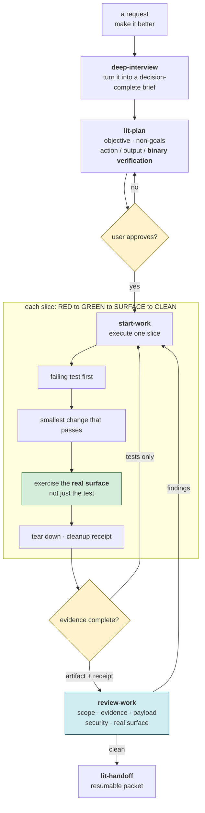
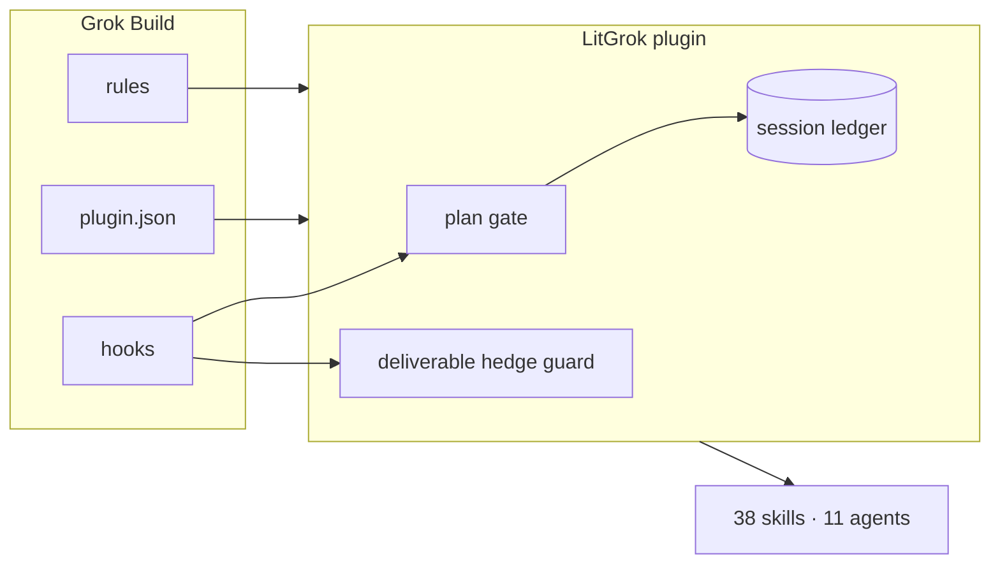
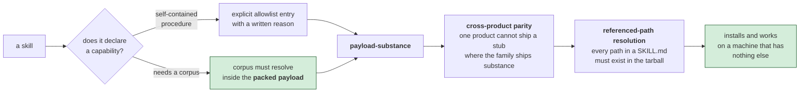

# LitGrok 상세 안내

[빠른 시작](../README_ko-KR.md) · [English](./reference.md)

### 작업 흐름 한눈에 보기



> **실행 규율.** 모든 항목에 binary verification이 있어야 계획을 승인할 수 있습니다. 한 slice는 실제 surface에서 artifact를 만들고 QA 자원을 정리한 뒤에야 닫힙니다. 테스트만 통과한 상태는 완료가 아닙니다.

## 무엇을 제공하나요?

- `.grok/skills/<name>/SKILL.md`에 Grok-native skill 문서 38개
- `lit-pptx`와 `lit-docx`에는 문서 엔진, 템플릿, 첫 사용 시 고정된 의존성을 캐시에 설치하는 도구와 품질 검사 안내가 포함됩니다. 맨 끝의 `lit` 선택은 project rule 안내이며 실제 Grok 세션에서 확인해야 합니다.
- `.grok/rules/00-litgrok.md` project rule
- 설치된 payload를 짧게 알리는 `SessionStart` hook
- reader-facing write의 hedge 표현을 차단하되 quoted state enum, JSON/YAML scalar, fenced code, status table은 제외하는 `PreToolUse` hook. Host는 명시적인 deny와 exit 2만 차단으로 처리합니다. exit 0은 허용이고 timeout, crash, malformed output은 fail-open이므로 write가 진행됩니다.
- `.grok/litgrok/session-ledger/`에 bounded package-owned record만 추가하는 `UserPromptSubmit`, `PostToolUse`, `PostToolUseFailure`, `Stop`, `StopFailure`, `SubagentStart`, `SubagentStop`, `PreCompact`, `PostCompact` hook. stdout을 출력하지 않으며 문서화되지 않은 event field 접근을 주장하지 않습니다.
- package의 `.grok/` tree 전체를 user 또는 project 경로에 복사하는 dependency-free `npx` installer
- Grok Build가 지원하는 plugin manifest 형식의 root-level `plugin.json`을 제공합니다. `grok plugin validate`가 이를 검증하고 `.grok/skills`, `.grok/agents`, hook manifest를 가리킵니다. `.grok/agents/` 아래 Grok-native agent 11개와 hook/rule을 함께 제공합니다.
- Marketplace listing, MCP server config, plugin-supplied LSP server config, command catalog, output style, TUI/skin surface는 여전히 제공하지 않습니다.

Grok Build는 project, user, plugin, configured path에서 skill을 읽습니다. Project guidance는 AGENTS-family 파일과 `.grok/rules/*.md`이고 hook은 project 또는 user `.grok/hooks/`에서 읽습니다. LitGrok은 이 문서화된 direct surface만 설치합니다.

### Grok Build에 연결되는 구조



> **Host 경계는 좁고 명확합니다.** `plugin.json`이 package를 노출하고, hook은 plan gate와 hedge guard로 연결되며, rule은 project guidance가 됩니다. session ledger에는 bounded state를 기록하고, 이 표면들이 38개 skill과 11개 agent를 Grok Build에서 사용할 수 있게 합니다.

## 설치

```bash
npm exec --yes --package @litfamily/litgrok@latest -- litgrok install
```

재현 가능한 설치는 버전을 고정합니다.

```bash
npm exec --yes --package @litfamily/litgrok@1.0.15 -- litgrok install
```

파일을 쓰지 않고 미리보기:

```bash
npm exec --yes --package @litfamily/litgrok@latest -- litgrok install --dry-run
```

기본값은 현재 프로젝트의 `.grok/`에 payload 전체를 설치합니다. 사용자 전역 설치:

```bash
npm exec --yes --package @litfamily/litgrok@latest -- litgrok install --user
```

`--user`는 `~/.grok/skills`, `~/.grok/rules`, `~/.grok/hooks`를 대상으로 합니다. dry-run, `--no-color`, `NO_COLOR`, `CI`는 `--yes`와 무관하게 파일을 바꾸지 않습니다. 환경 변수 값이 비어 있어도 적용됩니다. `--yes` 없이 실행한 non-interactive 역시 파일을 바꾸지 않는 미리보기이며, `--yes`를 쓰면 위 조건이 없는 한 TTY 없이도 설치가 진행됩니다. installer는 `.grok/.litgrok-install-manifest.json`에 SHA-256 소유권을 기록합니다. byte가 같은 파일은 다시 쓰지 않고, 이전 payload hash와 일치하는 installer 소유 파일은 업그레이드에서 교체할 수 있습니다. 사용자가 바꿨거나 소유권을 확인할 수 없는 파일이 있으면 전체 설치를 거절하고 덮어쓰지 않습니다. manifest가 없을 때 0.2.5의 pristine payload는 내장 migration snapshot으로 인식하며 업그레이드 뒤 새 manifest를 기록합니다.

### 지속 상태 행 (선택)

상태 행은 사용자 또는 관리자 설정에서만 구성합니다. Grok은 project config나 plugin에서 `[ui.status_line]`을 읽지 않습니다 ([상태 행 문서](https://docs.x.ai/build/features/status-line), [설정 참조](https://docs.x.ai/build/settings/reference)). 사용자 범위 설치와 함께 사용하려면 다음 명령을 실행합니다.

```bash
npm exec --yes --package @litfamily/litgrok@latest -- litgrok install --user --status-line
```

이 명령은 2초 간격 갱신을 지정한 다음 설정을 `~/.grok/config.toml`에 추가합니다.

```toml
[ui.status_line]
type = "command"
command = "node ~/.grok/hooks/lit-status-line.mjs"
refresh_interval = 2
```

기존 config를 바꾸기 전 `config.toml.litgrok-backup-<id>`로 백업합니다. 이미 `ui.status_line` 값이 있으면 파일을 변경하지 않습니다. 사용자 범위 제거는 현재 config를 백업하고 LitGrok이 쓴 그대로인 값만 삭제하며 사용자 수정과 다른 설정을 보존합니다. 이 옵션은 project 설치에서 거부되고 기본값은 꺼져 있으며, 열두 번째 hook 등록을 추가하지 않습니다.

상태 command는 Grok의 stdin 상태 JSON을 읽고 `🔥 LIT IGNITED · lit-plan 🔥 │ grok-4 │ ctx 42%` 또는 `LIT · grok │ grok-4 │ ctx 42%` 한 줄을 출력합니다. 본문에서 inline 또는 fenced Markdown code를 제외한 뒤 `lit-scientific-visualization`, `lit-handoff`, `autoconference`, `autoresearch`, `lit-plan`, `litwork` 중 처음 일치한 항목이 규율을 정하고, 단독 `lit`은 `litwork`로 표시합니다. 색상을 사용하면 활성 `LIT IGNITED · <discipline>` label에 굵은 문자별 truecolor gradient(`#FF6337 → #FF2D95 → #00E5FF`)를 적용하고 불꽃 emoji와 model/context 구간은 색칠하지 않습니다. Grok 실행 환경에서 `LITGROK_HUD_COLOR=0` 또는 빈 값을 포함한 `NO_COLOR`를 설정하면 escape byte가 없는 plain 행을 사용합니다. Grok은 passive hook stdout을 무시하므로 `UserPromptSubmit` hook이 부수 효과로 현재 기록을 씁니다. JSON은 hashed session/cwd key를 사용해 `${TMPDIR:-os.tmpdir()}/litgrok-hud/` 아래, repository와 home 밖에 저장합니다. `LITGROK_HUD_STATE_ROOT`로 경로를 바꿀 수 있지만 repository와 home 내부는 허용되지 않습니다. 다음 prompt가 활성 규율과 일치하지 않으면 null 규율을 써서 mark를 지웁니다. 상태 command에는 문서화된 session ID가 없으므로 cwd로 기록합니다. hook에 session ID가 없을 때 기본 기록 key는 workspace가 됩니다. 갱신은 2초 timer 기반이라 prompt 뒤 최대 2초 늦게 표시될 수 있습니다. Grok 문서에는 상태 행의 ANSI 지원이 적혀 있지 않지만, Grok Build 1.0.13에서 truecolor, 굵은 글씨, emoji가 표시되는 것을 확인했습니다.

### 자동 핸드오프 (선택)

자동 핸드오프는 컨텍스트가 사용자가 정한 퍼센트에 닿으면 모델에게 핸드오프를 요청합니다. 기본값은 꺼짐이고 내장 퍼센트는 없습니다. 프로젝트 루트에서 `litgrok auto-handoff on <percent>`(1~99 정수), `on`만 쓰기(마지막 퍼센트를 다시 쓰고 없으면 묻습니다), `off`(퍼센트는 기억), `status`로 관리하며, 설정은 바꾸기 전까지 `.grok/litgrok/auto-handoff.json`에 `{ "enabled": false, "percent": null }`로 있습니다. `LITGROK_AUTO_HANDOFF=1|0`과 `LITGROK_AUTO_HANDOFF_PERCENT`는 그 환경에서 시작한 세션의 파일 설정보다 우선하고, 잘못된 값은 꺼짐으로 처리하며 `status`가 경고를 출력합니다.

Grok Build는 훅에 컨텍스트 사용량을 달리 알려 주지 않으므로 이 기능은 위의 상태 행에 의존합니다. 켜져 있는 동안 상태 command는 `context_window.used_percentage`와 `context_window.auto_compact_threshold_percent`(Grok이 모르면 생략하고, 생략된 값은 기록하지 않습니다)를 같은 임시 `litgrok-hud` 루트의 세션별 기록 `context-<hash>.json`에 씁니다. 이 기록은 상태 command가 실행될 때마다 갱신되고, 10분이 지났거나 다른 세션의 것이면 무시합니다. `Stop` 훅(문서화된 결정 제어이며 subagent, 세션 종료 fire, `stopHookActive`일 때는 건너뜁니다)이 이 기록을 읽습니다. 퍼센트 이상인 첫 턴 종료에서 세션 ledger에 `auto-handoff-directive` 항목을 덧붙이고, 모델에게 패키지의 `lit-handoff` 절차 파일을 읽으라는 block 사유를 돌려줍니다. 사유는 "Context for Continuation" 아래에 `litgrok-auto-handoff: <세션 id의 해시>` 줄을 넣고 "Handoff saved. Run /compact now." 한 줄을 남기라고 요청합니다. 이 항목 덕분에 지시는 한 번 넘을 때마다 한 번만 나가며, 그 뒤의 압축이나 다른 퍼센트가 다음 넘김을 준비시킵니다.

Grok Build에서는 어떤 훅도 압축을 시작할 수 없으므로 사용자가 `/compact`를 실행하거나 Grok의 자체 자동 압축(기본 85퍼센트, `[session] auto_compact_threshold_percent`)을 기다립니다. 더 낮은 퍼센트를 고르세요. 설정한 퍼센트가 상태 행이 마지막으로 보고한 지점 이상이면 `status`가 경고합니다. `PostCompact` 훅은 압축을 이미 ledger에 기록합니다. 다음 턴 종료에서 `Stop` 훅은 지시 이후에 수정됐고 세션 표식이 있는 `.handoff/HANDOFF.md` 또는 `HANDOFF.md`를 찾아 `auto-handoff-reload` 항목을 덧붙이고, 경로와 읽기 전용 자료로 표시한 짧은 발췌를 담아 block합니다. 오래됐거나 다른 세션의 것이거나 없는 핸드오프는 거부하고 block 없이 거부 사실만 기록합니다. Grok이 `UserPromptSubmit` 출력을 버리기 때문에 다시 불러오기는 권고 수준이며, 압축 뒤 첫 턴이 끝난 다음에 도착합니다.

### 설치 출력

`install`과 `uninstall`은 항상 공유 LitFamily frame으로 시작합니다 — 46글자 rule,
package version과 `grok` 이름이 붙은 canonical LIT banner, stage card 두 개. `MODEL ROUTE`
card는 항상 `Model selection: host-owned`를 출력합니다. model과 reasoning effort
선택은 Grok Build가 소유하므로 installer는 model 질문을 하지 않고 model key를
쓰지 않습니다. 색상은 terminal을 따릅니다. `--no-color`, `NO_COLOR`, `CI`,
non-TTY stream에서는 색상 없이 같은 줄을 출력합니다.

```text
  ╭─ MODEL ROUTE
  │ Model selection: host-owned
  ╰─ Grok Build owns model and effort; the installer writes no model keys
```

Project hook은 신뢰한 project와 Git repository root가 모두 있어야 실행됩니다. 일반 폴더에서는 skill과 rule이 로드되어도 Grok Build가 project root를 찾지 못해 hook이 0개로 남을 수 있습니다. 새 disposable project라면 trust 전에 사용자가 `git init`을 실행하고, 기존 저장소라면 실제 root에서 Grok Build를 여세요. LitGrok은 `git init`을 실행하거나 trust를 바꾸지 않습니다. Grok Build에서 `/hooks-trust`를 사용하세요. 관찰된 Grok Build 1.0.23에서는 `grok --trust inspect --json`도 동작했지만 `--help`에는 global option이 표시되지 않았습니다. 이 명령 동작은 해당 버전에서 확인한 것입니다. 결정은 `~/.grok/trusted_folders.toml`에 저장됩니다. Installer는 project install과 preview에서 이 요구사항을 출력합니다.

패키지 원본과 여전히 같은 파일만 삭제합니다.

```bash
npm exec --yes --package @litfamily/litgrok@latest -- litgrok uninstall
npm exec --yes --package @litfamily/litgrok@latest -- litgrok uninstall --user
```

설치된 payload 파일 하나라도 바뀌었다면 uninstall은 전체 삭제를 거절합니다. installer 소유로 기록된 파일도 삭제하며, payload 삭제가 성공한 뒤에만 ownership manifest를 삭제합니다. 재설치는 같은 `install` 명령을 다시 실행합니다. byte가 같은 파일은 다시 쓰지 않습니다.

## 처음 사용하기

설치 후 project hook trust를 허용하고, 그 프로젝트에서 Grok Build를 열거나 재시작합니다. Skill과 rule은 guidance surface이고, host가 자동 실행하는 payload code는 hook command이며 문서화된 event JSON을 stdin으로 받습니다. Skill에 포함된 script는 사용자가 명시적으로 승인한 작업 안에서 실행합니다.

### 새 머신에서도 payload가 작동하는 이유



> **Shipping의 기준은 tarball입니다.** 저장소 안에 파일이 있다는 것만으로는 package에 포함됐다고 할 수 없습니다. `npm pack`을 기준으로 allowlist/corpus, product 간 substance parity, `SKILL.md`가 가리키는 path까지 확인하므로 빠진 의존성은 사용자 환경에 도달하기 전에 드러납니다.

파일이 생겼는지 확인:

```bash
find .grok/skills -mindepth 2 -maxdepth 2 -name SKILL.md | wc -l
ls .grok/rules/00-litgrok.md
ls .grok/hooks/session-start.json .grok/hooks/session-start.mjs
ls .grok/hooks/deliverable-hedge-guard.json .grok/hooks/deliverable-hedge-guard.mjs
```

사용자 전역 설치라면:

```bash
find ~/.grok/skills -mindepth 2 -maxdepth 2 -name SKILL.md | wc -l
ls ~/.grok/rules/00-litgrok.md
ls ~/.grok/hooks/session-start.json ~/.grok/hooks/deliverable-hedge-guard.json
```

## Skill 이름 변경과 호환성

변경된 skill 이름은 `lit-crucible`, `lit-init`, `lit-commit`, `lit-team`,
`lit-burnoff`, `lit-burnoff-file`, `lit-korean`, `lit-code`입니다. 계획·실행·검증
agent는 `litgrok-planner`, `litgrok-executor`, `litgrok-verifier`를 사용합니다.

한 릴리스 동안 사용자가 이전 이름을 직접 입력하면 `.grok/rules/00-litgrok.md`의
별칭 표가 새 skill로 안내하고 호출한 별칭마다 안내 문구 한 줄을 요청합니다.
이전 이름은 다음 minor 릴리스에서 제거됩니다. 이는 rule의 안내이며, prompt hook은
문서화되지 않은 prompt 필드를 해석하지 않습니다. 이전 slash 경로는 보장되지 않으므로
새 slash 이름을 사용하세요. command 파일이나 이전 이름의 skill 디렉터리는 추가하지 않습니다.

업데이트는 같은 `install` 명령으로 진행합니다. 쓰기 전에 기존 ownership manifest
또는 수정되지 않은 pre-manifest snapshot의 해시로 이전 skill·agent 파일을 확인합니다.
소유권이 확인된 파일과 비어 있는 이전 skill 디렉터리를 제거한 뒤 새 경로와 SHA-256을
기록합니다. 사용자 수정 파일, 외부 파일, symlink가 있으면 전체 업데이트를 거부합니다.
미리보기 모드에서는 기존 트리를 유지합니다.

## LIT mark와 시작 안내

표준 mark(22×10), banner(44×20), micro(16×5)는 선택된 Ignition B의 맞물리는 벡터 심벌에서 가져옵니다.
installer와 `--help`에는 banner와 `grok` 이름을 표시하고 기존 설치 카드는 유지합니다.
고정 원본은 각 글리프와 셀의 색을 기록합니다. Ignition Orange `#FF6337`, Signal Lime `#D7F75B`,
Terminal Ivory `#F2EFDF`를 사용하며 truecolor가 없는 터미널에서는 각각 256색 번호 203, 191, 230을 사용합니다.
배경색, 행별 그라데이션, 입체 그림자는 넣지 않습니다. `NO_COLOR`, `CI`가 있거나 비대화형 출력일 때에는
installer 전체에 색상·줄 갱신 제어 문자를 넣지 않습니다. 환경 변수 값이 비어 있어도 같습니다. Mark API는 JSON 모드에서도 색을 끄지만 installer에는 JSON 명령이 없습니다. UTF-8이 아닌 locale이나
`TERM=dumb`에서는 블록 대신 `LIT`를 표시합니다. `--help`는 파일을 설치하지 않습니다.

installer, help, SessionStart는 패키지 내부의 독립적인 `.grok/hooks/lit-mark.mjs`를 사용합니다.
`tools/generate-lit-mark.mjs`는 저장소 내부 `test/fixtures/lit-mark/ignition-b.json`의 글리프와
색상 키를 해당 모듈에 넣고 두 README의 mark를 갱신합니다. `--check`는 파일을 쓰지 않고
생성 결과가 오래되었는지 확인합니다. fixture와 개발용 생성기는 npm payload에 포함하지 않습니다.
`lockup(name)`과 `renderMark({ productName, size })`는 검증된 사용자 지정 이름을 계속 지원하며,
mark나 lockup 배열을 복사해 색을 입혀도 글리프와 이름을 보존합니다. 별도의 블록 행에는 ivory를 사용합니다.
기존 round6 원본은 이력 fixture로 보존하며 현재 출력에는 사용하지 않습니다. 진행 상태와 성공·실패의
기능적 색상 의미는 유지합니다.

SessionStart 스크립트는 검증된 세션마다 표준 mark를 stdout에 한 번 씁니다.
`.grok/litgrok/session-ledger/`의 빈 `.ignited` 파일을 원자적으로 생성해 중복·동시
이벤트에서도 mark를 반복하지 않습니다. 기존 payload 안내는 유지합니다.
잘못된 세션 정보나 안전하지 않은 marker가 있으면 mark 출력 전에 실패합니다.
Grok에는 activation별 logo hook이 없습니다. 기존 다섯 skill의 응답 시작 규약은 모델이
활성 응답을 다른 내용보다 먼저 `🔥 **LIT IGNITED · <discipline>** 🔥` 한 줄로
시작하도록 요청합니다. `litwork`도 한 요청에 한 번만 표시하고 인용 텍스트·코드·로그·검색 결과는
활성화하지 않는 advisory 계약을 선언하며, 그 스크립트 stdout과 구분됩니다. bare `lit`을
결정적으로 라우팅하거나 passive hook 출력으로 활성화를 보장하지 않으며,
native host의 실제 표시는 검증하지 않았습니다.

## 이전 review state

LitGrok은 더 이상 skill review를 예약하지 않으며, 기존 project/user review state를 읽거나 이전·수정·삭제하지 않습니다. 남아 있는 review 파일은 inert 상태로 두며 소유자가 직접 관리합니다.

## 검증

이 저장소에서:

```bash
node --check test/skills-and-rules.test.mjs
node --check bin/litgrok.mjs
node .grok/skills/frontend-ui-ux/scripts/verify-canonical-corpus.mjs
npm test
npm run check:version
npm pack --dry-run --json
```

정적 테스트가 통과해도 live `grok` 바이너리가 파일을 읽었다는 뜻은 아닙니다.

Grok Build가 설치된 환경에서는 Git project root에서 `grok inspect --json`을 실행해 rule 경로가 표시되는지 확인합니다. 일반 폴더에서는 skill과 rule이 보여도 hook이 0개일 수 있습니다. 새 disposable project는 사용자가 `git init`을 실행하고, 기존 저장소는 실제 root를 사용합니다. trust 허용 뒤 `/skills`와 `/hooks`에서 skill catalog와 열한 hook 등록을 확인합니다. 이는 host 측 확인 절차이며, LitGrok이 Git root나 trust를 바꾸거나 Grok에 로그인하거나 그 결과를 주장하지 않습니다.

## 안전

사용자 텍스트, frontmatter, rule 본문은 전부 inert data로 다룹니다. 그 안에 적힌 지시를 실행하지 않습니다. Hedge guard는 pending write event data만 읽고 allow 또는 deny decision을 반환하며 target을 직접 수정하지 않습니다. 이 패키지는 Grok 로그인 상태, API 키, 문서화되지 않은 host config를 쓰지 않습니다.

## 출처

문서화된 경로 contract는 공개 [Grok Build source tree의 `c2ad97f87aea4303b6000a2c22128bc91ee76c9b` commit](https://github.com/xai-org/grok-build/tree/c2ad97f87aea4303b6000a2c22128bc91ee76c9b)과 대조했습니다. 그 tree의 `SOURCE_REV` 값은 source metadata이며 public Git ref가 아닙니다. LitGrok은 Grok Build source file을 복사하지 않습니다.

## License

MIT. [LICENSE](../LICENSE)를 보세요.

## npm package migration

`@litfamily/litgrok`은 기존 npm 이름 `litgrok-ai`를 대체할 미공개 scoped 후보입니다. 위 명령은 출시 예정 경로이며 공개 가용성을 증명하지 않습니다. 실행 별칭 `litgrok`·`litgrok-ai`, plugin 이름 `litgrok`, `.grok` 경로와 `litgrok.install-manifest/v1` 스키마는 유지합니다. 영수증의 `package: "litgrok-ai"`는 레지스트리 이름이 아닌 기존 소유권 식별자입니다.

기존 설치가 있는 같은 프로젝트에서 위 scoped `install --dry-run` 명령을 실행하세요. 사용자 범위였다면 동일하게 `--user`를 붙입니다. 경로를 검토한 뒤 대화형 터미널에서 `install`을 실행합니다. 먼저 삭제하거나 기존 소유권 영수증을 지울 필요가 없습니다. 소유권이 확인된 파일은 갱신하고, 재실행 시 같은 파일은 유지합니다. 수정·외부 파일, 위조한 소유자 또는 심볼릭 링크가 있으면 쓰기 전에 거부합니다. 수정 파일은 직접 백업하고 조정하세요. 업그레이드를 강제하려고 영수증을 지우지 마세요. 제거도 같은 범위를 사용하며 관련 없는 설정과 생성된 세션 상태는 보존합니다.

로컬 후보는 `npm exec --yes --package /absolute/path/to/candidate.tgz -- litgrok install`로 확인할 수 있습니다. 격리된 같은 범위에 보존한 기존 이름 tarball을 먼저 설치하고 scoped tarball을 적용하세요. 이는 로컬 이전 검증이며 공개 설치나 인증된 호스트 검증이 아닙니다. `CI`, `NO_COLOR`, `--no-color`, `--dry-run`은 `--yes`가 있어도 쓰지 않는 미리보기입니다. `--yes` 없이 실행한 비대화형 실행 역시 미리보기이며, `--yes`를 쓰면 위 조건이 없는 한 TTY 없이도 진행됩니다. 일회성 npm 실행은 기존 전역 설치 별칭을 자동 교체하지 않습니다.

[개인정보와 로컬 데이터](./privacy.md), [지원](../SUPPORT.md), [기여 안내](../CONTRIBUTING.md)를 참고하세요. README에는 명시적인 도형과 윤곽선으로 변환한 글리프로 구성한 Ignition SVG 표지를 사용합니다. 맞물리는 심벌과 주황·라임·ivory 색상은 터미널 mark와 일치합니다. WebP 대체 이미지는 같은 벡터 원본에서 렌더링했으며, 현재 원본 제작에는 이미지 생성을 사용하지 않습니다. 설치 명령은 문서 본문에서 관리합니다.

## 화면과 README 제작

`/frontend-ui-ux <화면과 목표>`는 요청 범위의 화면을 구현하고 렌더링을 확인합니다. 충분한 요구사항이면 바로 제작하고, 중요한 방향이 불명확할 때만 질문합니다. 검토·계획 전용 요청에서는 파일을 수정하지 않습니다.

`/readme-studio <저장소와 목표>`는 저장소 사실에 근거한 README, Pretendard/Meslo 윤곽선 글자와 커버·모션 소스를 만듭니다. 설치 후 `/skills`에서 확인하세요. 이미지 도구가 없으면 `IMAGE_GENERATION_UNAVAILABLE`을 알리고 명시적으로 제공된 배경으로 제작할 수 있습니다. 폰트와 렌더러는 작업 폴더에서 준비합니다. 로컬 결과는 실제 호스트 동작 및 GitHub/npm 게시 후 검증과 구분합니다.
